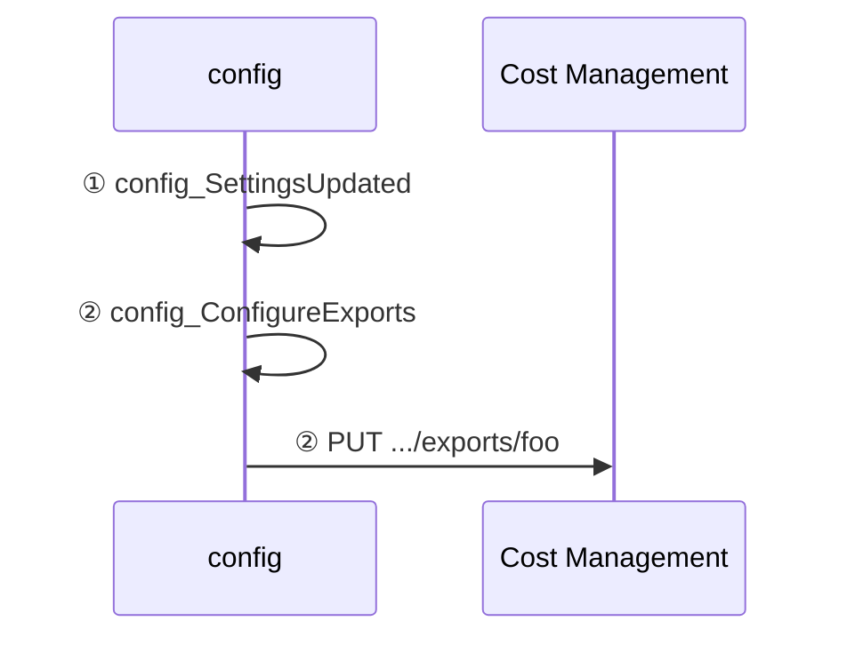

<!-- markdownlint-disable-next-line MD025 -->
# How data is processed in FinOps hubs

FinOps hubs perform many data processing activities to clean up, normalize, and optimize data. The following sections show how data flows from Cost Management into a hub instance.

<br>

## Scope setup

A **scope** is a level within the cloud resource and account hierarchy that provides access to cost, usage, and carbon data. For FinOps hubs, we typically recommend using Enterprise Agreement (EA) billing accounts or Microsoft Customer Agreement (MCA) billing profiles, however any cloud scope is sufficient for basic analysis. The main concern is about whether price and reservation data is needed, since Cost Management only exposes the data for EA billing accounts and MCA billing profiles.

FinOps hubs support configuring scopes by manually configuring Cost Management exports or by granting FinOps hubs access to manage scopes on your behalf. Managed scopes are configured in the **config/settings.json** file in hub storage. The information describes what happens when a new, managed scope is added into this file. Unmanaged scopes, where Cost Management exports are manually configured, don't require other setup.

:::image type="content" source="./media/data-processing/scope-setup.png" border="false" alt-text="Diagram depicting the scope setup process." lightbox="./media/data-processing/scope-setup.png" :::

1. The **config_SettingsUpdated** trigger runs when the **settings.json** file is updated.
2. The **config_ConfigureExports** pipeline creates new exports for any new scopes that were added.

<br>

## Data ingestion

The following diagram depicts the end-to-end data ingestion process within FinOps hubs:

:::image type="content" source="./media/data-processing/data-ingestion.png" border="false" alt-text="Diagram depicting the data ingestion process." lightbox="./media/data-processing/data-ingestion.png" :::

1. (Optional) If using managed exports:
   1. The **config_DailySchedule** and **config_MonthlySchedule** triggers run on their respective schedules to kick off data ingestion.
   2. The **config_StartExportProcess** pipeline gets the applicable exports for the schedule that is running.
   3. The **config_RunExportJobs** pipeline executes each of the selected exports.
2. Cost Management exports raw cost details to the **msexports** container. [Learn more](#about-exports).
3. The **msexports_ExecuteETL** pipeline queues the extract-transform-load (ETL) pipeline when files are added to the **msexports** container.
4. The **msexports_ETL_ingestion** pipeline transforms the data to parquet format and moves it to the **ingestion** container using a scalable file structure. [Learn more](#about-the-ingestion-container).
5. (Optional) If using Azure Data Explorer:
   1. The **ingestion_ExecuteETL** pipeline queues the Data Explorer ingestion pipeline when **manifest.json** files are added to the **ingestion** container.
      - If ingesting custom datasets outside of Cost Management exports, create an empty **manifest.json** file in the target ingestion folder after all other files are ready (don't add this file when files are still uploading). The **manifest.json** file isn't parsed and can be empty. The sole purpose is to indicate that all files for this ingestion job are added.
      - The pipeline verifies the operational status of the Data Explorer Instance and starts the instance if it is not already running. **This process may take up to 15 minutes**
   2. The **ingestion_ETL_dataExplorer** pipeline ingests data into the `{dataset}_raw` table in the Data Explorer.
      - The dataset name is the first folder in the **ingestion** container.
      - All raw tables are in the **Ingestion** database in Data Explorer.
   3. When data is ingested into raw tables in Data Explorer, an update policy copies the data into the corresponding `{dataset}_final_v1_0` table using the `{dataset}_transform_v1_0()` function to normalize all data to align to FOCUS 1.0.
   4. After ingestion, the **ingestion_ETL_dataExplorer** pipeline performs some cleanup, including purging data in the final table that is past the data retention period.
      - As of 0.7, Data Explorer applies data retention in raw tables while data retention in final tables is applied by the ingestion pipeline. If data ingestion stops, historical data isn't purged.
      - Data retention can be configured during the template deployment or manually in the **config/settings.json** file in storage.
6. Reports and other tools like Power BI read data from Data Explorer or the **ingestion** container.
   - Data in Data Explorer can be read from the **Hub** database.
     - Use the `{dataset}()` function to use the latest schema.
       - This function is useful for quick exploration, but may introduce breaking changes as the FinOps hub instance is updated.
     - Use the `{dataset}_v1_0()` function to use the FOCUS 1.0 schema.
       - Versioned function schemas shouldn't change over time but values may change if the data source changes those values.
     - Avoid using the **Ingestion** database for queries. While not explicitly prohibited, the **Ingestion** database should be considered an internal area for staging and data preparation.
   - Data in storage can be read from `ingestion/<dataset>/<year>/<month>/<scope-path>`.
     - Data should be read recursively from the dataset folder and optionally including more as needed for specificity.
     - Files in each dataset folder may have different schemas based on the data source and account type. Be prepared to transform data if ingesting in other systems, like Microsoft Fabric.
     - Reading from storage is discouraged due to performance reasons. Data Explorer is recommended when reporting on more than $1 million in cost.

<br>

## About Data Explorer ingestion

When data is ingested into Data Explorer, the `{dataset}_transform_v1_0()` functions apply transform rules in the **Ingestion** database. Each dataset has a different set of transform rules covered in the following sections.

For a list of requested changes, ideas under consideration, and open questions about the underlying Cost Management datasets, see [issue #1111](https://github.com/microsoft/finops-toolkit/issues/1111). Leave comments on that issue if you find opportunities to address any concerns or to voice your support for any of the specific issues.

### Cost data transforms

Supported datasets:

- Microsoft FocusCost: `1.0r2`, `1.0`, `1.0-preview(v1)`

The following datasets were accounted for in the design, but are not natively supported. To ingest these datasets, create a data pipeline (or external process) that pushes parquet files into the `ingestion/Costs/yyyy/mm/{scope-path}` folder in storage. The `{scope-path}` can be any unique path, like `aws/123` or `gcp/projects/foo`. The only requirement is to ensure each scope is in a separate folder. After copying external content, also create a **manifest.json** file to trigger Data Explorer ingestion.

- Amazon Web Services (AWS) FOCUS 1.0
- Google Cloud Platform (GCP) FOCUS 1.0
- Oracle Cloud Infrastructure (OCI) FOCUS 1.0

Transforms:

- v0.7+:
  - Align FOCUS 1.0-preview column names to FOCUS 1.0.
    - Includes converting FOCUS 1.0 preview to 1.0.
  - Add `x_IngestionTime` to indicate when the row was last updated.
  - Add `x_SourceChanges` to identify when data in a row is changed by hubs.
  - Update `ProviderName` and `PublisherName` when not specified.
  - Add `x_SourceName`, `x_SourceProvider`, `x_SourceType`, and `x_SourceVersion` to identify the original ingested dataset.
  - Populate missing `ListCost`, `ListUnitPrice`, `ContractedCost`, and `ContractedUnitPrice` values based on the price sheet.
    - This process requires prices to be exported before the cost. Prices being missing for the first day of the month if costs are ingested before pries are available for the month.
  - Fix `ContractedCost` when set incorrectly due to a bug in Cost Management.
  - Lowercase `ResourceName` and `x_ResourceGroupName` to address casing consistency issues that break grouping and filtering.
  - Add `x_BillingAccountAgreement` based on the account type.
- v0.8+:
  - Fix any `ResourceType` values that use internal resource type IDs (for example, microsoft.compute/virtualmachines).
- v0.9+:
  - Lowercase `BillingAccountId` to ensure the price join matches all rows.
  - Lowercase `CommitmentDiscountId` to avoid duplicate rows when aggregating data.
  - Add new `x_SourceChanges` checks for `ListCostLessThanContractedCost` and `ContractedCostLessThanEffectiveCost`.
- v0.10+:
  - Fix `x_EffectiveUnitPrice` when it's calculated and there is a rounding error compared to `x_BilledUnitPrice` or `ContractedUnitPrice`.
  - Calculate PricingQuantity and ConsumedQuantity when there is cost but no quantity.
  - Set `ContractedCost` to `EffectiveCost` when it's not set.
  - Set `ListCost` to `ContractedCost` when it's not set.
  - Remove "-2" in the `x_InvoiceSectionId` column.
  - Remove "Unassigned" in the `x_InvoiceSectionName` column.
  - Corrected `x_EffectiveUnitPrice` when it's calculated and has a rounding error.
  - Add new `x_SourceChanges` checks for `MissingConsumedQuantity`, `MissingPricingQuantity`, and `XEffectiveUnitPriceRoundingError`.
- v0.10+:
  - Change `BillingPeriodStart` and `BillingPeriodEnd` to be the first of the month.

### Price data transforms

Supported datasets:

- Microsoft PriceSheet: `2023-05-01` (EA and MCA)

Transforms:

- v0.7+
  - Align column names to FOCUS 1.0.
    - Includes enforcing EA and MCA column name consistency.
    - Doesn't change the underlying values, which may differ across EA and MCA.
  - Convert `x_SkuTerm` ISO duration to the specific number of months to match cost details.
    - We're waiting for FOCUS to make a determination for how to define durations before changing this value to ISO or another format.
  - Replace `ContractedUnitPrice` for savings plan usage with the on-demand equivalent.
  - Set `ListUnitPrice` for savings plan usage set to the on-demand equivalent.
  - Add `SkuPriceIdv2` as a more accurate `SkuPriceId` value than what is currently in cost details.
  - Add `x_IngestionTime` to indicate when the row was last updated.
  - Add `x_CommitmentDiscountSpendEligibility` and `x_CommitmentDiscountUsageEligibility`.
  - Expand `x_PricingUnitDescription` into `PricingUnit` and `x_PricingBlockSize`.
  - Add `x_BillingAccountAgreement` based on the account type.
  - Change `x_EffectivePeriodEnd` to be an exclusive end date.
  - Add `x_EffectiveUnitPriceDiscount`, `x_ContractedUnitPriceDiscount`, and `x_TotalUnitPriceDiscount` to summarize available discounts per SKU.
  - Add `x_EffectiveUnitPriceDiscountPercent`, `x_ContractedUnitPriceDiscountPercent`, and `x_TotalUnitPriceDiscountPercent` to summarize the percentage of the discount per SKU.
  - Add `x_SourceName`, `x_SourceProvider`, `x_SourceType`, and `x_SourceVersion` to identify the original ingested dataset.
- v0.9+:
  - Lowercase `BillingAccountId` to ensure the cost join matches all rows.

### Recommendation data transforms

Supported datasets:

- Microsoft ReservationRecommendations: `2023-05-01` (EA and MCA)

Transforms:

1. Align column names to FOCUS 1.0.
   - Includes enforcing EA and MCA column name consistency.
   - Doesn't change the underlying values, which may differ across EA and MCA.
2. Add `x_SourceName`, `x_SourceProvider`, `x_SourceType`, and `x_SourceVersion` to identify the original ingested dataset.

### Transaction data transforms

Supported datasets:

- Microsoft ReservationTransactions: `2023-05-01` (EA and MCA)

Transforms:

1. Align column names to FOCUS 1.0.
   - Includes enforcing EA and MCA column name consistency.
   - Doesn't change the underlying values, which may differ across EA and MCA.
2. Add `x_SourceName`, `x_SourceProvider`, `x_SourceType`, and `x_SourceVersion` to identify the original ingested dataset.

### Commitment discount usage data transforms

Supported datasets:

- Microsoft ReservationDetails: `2023-03-01` (EA and MCA)

Transforms:

1. Align column names to FOCUS 1.0.
   - Includes enforcing EA and MCA column name consistency.
   - Doesn't change the underlying values, which may differ across EA and MCA.
2. Add `ResourceType` column with the resource type display name.
3. Add `ServiceName`, `ServiceCategory`, and `x_ServiceModel` columns.
4. Replace "NA" will null for `x_CommitmentDiscountNormalizedGroup`.
5. Add `x_CommitmentDiscountQuantity` based on FOCUS 1.1.

<br>

## About the ingestion container

FinOps hubs rely on a specific folder path and file name format in the **ingestion** storage container:

```text
ingestion/{dataset}/{date-folder-path}/{scope-id-path}/{ingestion-id}__{original-file-name}.parquet
```

- `ingestion` is the container where the data pipeline saves data.
- `{dataset}` is the exported dataset type. If ingesting into Azure Data Explorer, the **Ingestion** database must have a matching, case-sensitive "_raw" table (for example, "Costs_raw"). FinOps hubs support the following datasets in this release:
  - **CommitmentDiscountUsage** - Cost Management reservation details export.
  - **Costs** - FOCUS cost and usage data.
  - **Prices** - Cost Management price sheet export.
  - **Recommendations** - Cost Management reservation recommendations export.
  - **Transactions** - Cost Management reservation transactions export.
  - To ingest custom datasets, create a matching `{dataset}_raw` table and parquet ingestion mapping in the **Ingestion** database.
- `{date-folder-path}` can be one or more folders that indicate how many ingested datasets should be retained. Examples:
  - `all` (or any placeholder) to not track history for the dataset. Every ingestion replaces the previous data. Not supported in storage-based Power BI reports.
  - `{yyyy}` as a four-digit year of the exported dataset to only retain the latest ingestion per year. Not supported in storage-based Power BI reports.
  - `{yyyy}/{mm}` as a four-digit year and two-digit month of the exported dataset to retain the latest ingestion per month.
  - `{yyyy}/{mm}/{dd}` as a four-digit year, two-digit month, and two-digit day of the exported dataset to retain the latest ingestion per day. Not supported in storage-based Power BI reports.
- `{scope-id-path}` is the fully qualified resource ID of the scope the data is from. If ingesting non-Azure data, we recommend using a logical hierarchy based on the scope of data (for example, `aws/{account-id}`, `gcp/{project-name}`, `oci/{component-id}/{component-id}`).
- `{ingestion-id}` is a unique ID for the ingested dataset. This ID can be a GUID, a timestamp, or any value as long as it's consistent across all files for the ingested dataset. This value is used to remove previously ingested data in the same folder path.
- `{original-file-name}` is intended to be the original file name or other identifier to indicate where the data in the file originated. This value is for your troubleshooting purposes only.

The full folder path and ingestion ID are both used to ensure data isn't duplicated in storage or in Azure Data Explorer. The original file name is added to Azure Data Explorer extents for troubleshooting purposes, but isn't otherwise tracked or used by FinOps hubs.

If you need to use hubs to monitor non-Azure data, convert the data to [FOCUS](../../focus/what-is-focus.md) and drop it into the **ingestion** container using this guidance. Note support for non-Azure data hasn't been explicitly tested in the latest release. If you experience any issues, [create an issue](https://aka.ms/ftk/idea).

<br>

## About exports

FinOps hubs leverage Cost Management exports to obtain cost data. Cost Management controls the folder structure for the exported data in the **msexports** storage container. A typical path looks like:

```text
{container}/{path}/{date-range}/{export-name}/{export-time}/{guid}/{file}
```

FinOps hubs utilize the manifest file to identify the scope, dataset, month, etc. The only important part of the path for hubs is the container, which must be **msexports**.

Don't export data to the **ingestion** container. Exported CSVs _must_ be published to the **msexports** container to be processed by the hubs engine.

To ingest custom data, save parquet files in the **ingestion** container for the FinOps toolkit Power BI reports to work as expected. After all parquet files are added, add an empty **manifest.json** file to trigger ingestion.

To ingest CSV file from Cost Management exports, save files in a specific folder in the **msexports** container. After all files are added, add a **manifest.json** file based on the below template. Make the following changes to ensure successful ingestion:

1. Change `<export-name>` to a unique value within the scope for the dataset you're ingesting.
   - This is only used for recommendations to differentiate the many different types of recommendations getting ingested which aren't identifiable from the export manifest alone. For reservation recommendations, ideally include the service, scope (single/shared), and lookback period.
2. Change `<dataset>` and `<version>` to the Cost Management export type and version. See the list below for supported datasets.
3. Change `<scope>` to the Azure resource ID for the scope the data came from.
4. Change `<guid>` to a unique GUID.
5. Change `<yyyy-MM>` to the year and month of the dataset.
6. Change `<path-to-file>` to the full folder path under the container (do not include "msexports").
7. Change `<file-name>` to the name of the first file uploaded to storage.
8. If you have more than one CSV file, copy the blob object for each file you uploaded and update the file name.

```json
{
  "blobCount": 1,
  "dataRowCount": 1,
  "exportConfig": {
    "exportName": "<export-name>",
    "type": "<dataset>",
    "dataVersion": "<version>",
    "resourceId": "<scope>/providers/Microsoft.CostManagement/exports/export-name"
  },
  "runInfo": {
    "runId": "<guid>",
    "startDate": "<yyyy-MM>-01T00:00:00"
  },
  "blobs": [
    {
      "blobName": "<path-to-file>/<file-name>.csv"
    }
  ]
}
```

<a name="datasets"></a>FinOps hubs support the following dataset types, versions, and API versions:

- FocusCost: `1.0r2`, `1.0`, `1.0-preview(v1)`
- PriceSheet: `2023-05-01`
- ReservationDetails: `2023-03-01`
- ReservationRecommendations: `2023-05-01`
- ReservationTransactions: `2023-05-01`
- API versions: `2023-07-01-preview`

<br>

## FinOps hubs v0.6

The following sections explain data process in FinOps hubs 0.6.

### Scope setup in v0.6

The following steps happen when a new, managed scope is added to a hub instance. Unmanaged scopes (where Cost Management exports are manually configured) don't require any setup in hubs.
<!--


<br>
-->

1. The **config_SettingsUpdated** trigger runs when the **settings.json** file is updated.
2. The **config_ConfigureExports** pipeline creates new exports for any new scopes that were added.

<br>

### Data ingestion in v0.6

Data ingestion can be broken down into two parts:

1. Exports push data to storage.
2. Hubs processes and ingests data.

<!--
```mermaid
sequenceDiagram
    config->>config: ① config_Daily/MonthlySchedule
    config->>config: ② config_StartExportProcess
    config->>config: ③ config_RunExportJobs
    config->>Cost Management: ③ POST /exports/foo/run
    Cost Management->>msexports: ④ Export data
    msexports->>msexports: ⑤ msexports_ExecuteETL
    msexports->>ingestion: ⑥ msexports_ETL_ingestion
    Power BI-
    ->>ingestion: ⑨ Read data
```

<br>
-->

For managed scopes, hubs perform the following steps:

1. The **config_DailySchedule** and **config_MonthlySchedule** triggers run on their respective schedules to kick off data ingestion.
1. The **config_StartExportProcess** pipeline gets the applicable exports for the schedule that is running.
1. The **config_RunExportJobs** pipeline executes each of the selected exports.
1. Cost Management exports raw cost details to the **msexports** container. [Learn more](#about-exports-in-v06).
1. The **msexports_ExecuteETL** pipeline queues the extract-transform-load (ETL) pipeline when files are added to the **msexports** container.
1. The **msexports_ETL_ingestion** pipeline transforms the data to parquet format and moves it to the **ingestion** container using a scalable file structure. [Learn more](#about-ingestion-in-v06).
1. Power BI or other tools read data from the **ingestion** container.

After exports are run, whether managed or unmanaged, hubs perform the following steps:

1. The **msexports_ExecuteETL** pipeline kicks off the extract-transform-load (ETL) process when files are added to storage.
2. The **msexports_ETL_ingestion** pipeline transforms the data to parquet format and moves it to the **ingestion** container using a scalable file structure. [Learn more](#about-ingestion-in-v06).
3. Power BI or other tools read data from the **ingestion** container.

<br>

### About ingestion in v0.6

FinOps hubs rely on a specific folder path and file name format in the **ingestion** container:

```text
ingestion/{dataset}/{date-folder-path}/{scope-id-path}/{ingestion-id}__{original-file-name}.parquet
```

- `ingestion` is the container where the data pipeline saves data.
- `{dataset}` is the exported dataset type.
- `{date-folder-path}` can be one or more folders that indicate how many ingested datasets should be retained. Examples:
  - `all` (or any placeholder) to not track history for the dataset. Every ingestion replaces the previous data. Not supported in storage-based Power BI reports.
  - `{yyyy}` as a four-digit year of the exported dataset to only retain the latest ingestion per year. Not supported in storage-based Power BI reports.
  - `{yyyy}/{mm}` as a four-digit year and two-digit month of the exported dataset to retain the latest ingestion per month.
  - `{yyyy}/{mm}/{dd}` as a four-digit year, two-digit month, and two-digit day of the exported dataset to retain the latest ingestion per day. Not supported in storage-based Power BI reports.
- `{scope-id-path}` is the fully qualified resource ID of the scope the data is from. If ingesting non-Azure data, we recommend using a logical hierarchy based on the scope of data (for example, "aws/{account-id}", "gcp/{project-name}", "oci/{component-id}/{component-id}").
- `{ingestion-id}` is a unique ID for the ingested dataset. This ID can be a GUID, a timestamp, or any value as long as it's consistent across all files for the ingested dataset. This value is used to remove previously ingested data in the same folder path.
- `{original-file-name}` is intended to be the original file name or other identifier to indicate where the data in the file originated. This value is for your troubleshooting purposes only.

The full folder path and ingestion ID are both used to ensure data isn't duplicated in storage or in Azure Data Explorer. The original file name is added to Azure Data Explorer extents for troubleshooting purposes, but isn't otherwise tracked or used by FinOps hubs.

If you need to use hubs to monitor non-Azure data, convert the data to [FOCUS](../../focus/what-is-focus.md) and drop it into the **ingestion** container using this guidance. Note support for non-Azure data hasn't been explicitly tested in the latest release. If you experience any issues, [create an issue](https://aka.ms/ftk/idea).

<br>

### About exports in v0.6

FinOps hubs use Cost Management exports to obtain cost data. Cost Management controls the folder structure for the exported data in the **msexports** container. A typical path looks like:

```text
{container}/{path}/{date-range}/{export-name}/{export-time}/{guid}/{file}
```

As of 0.4, FinOps hubs don't rely on file paths. Hubs utilize the manifest file to identify the scope, dataset, month, etc. The only important part of the path for hubs is the container, which must be **msexports**.

> [!WARNING]
  > - Don't export data to the **ingestion** container. Exported CSVs **must** be published to the **msexports** container to be processed by the hubs engine.
  > - To ingest custom data, save FOCUS-aligned parquet files in the **ingestion** container for the FinOps toolkit Power BI reports to work as expected.


Export manifests can change with API versions. Here's an example with API version `2023-07-01-preview`:

```json
{
  "exportConfig": {
    "exportName": "<export-name>",
    "resourceId": "/<scope>/providers/Microsoft.CostManagement/exports/<export-name>",
    "dataVersion": "<dataset-version>",
    "apiVersion": "<api-version>",
    "type": "<dataset-type>",
    "timeFrame": "OneTime|TheLastMonth|MonthToDate",
    "granularity": "Daily"
  },
  "deliveryConfig": {
    "partitionData": true,
    "dataOverwriteBehavior": "CreateNewReport|OverwritePreviousReport",
    "fileFormat": "Csv",
    "containerUri": "<storage-resource-id>",
    "rootFolderPath": "<path>"
  },
  "runInfo": {
    "executionType": "Scheduled",
    "submittedTime": "2024-02-03T18:33:03.1032074Z",
    "runId": "af754a8e-30fc-4ef3-bfc6-71bd1efb8598",
    "startDate": "2024-01-01T00:00:00",
    "endDate": "2024-01-31T00:00:00"
  },
  "blobs": [
    {
      "blobName": "<path>/<export-name>/<date-range>/<export-time>/<guid>/<file-name>.<file-type>",
      "byteCount": ###
    }
  ]
}
```

FinOps hubs use the following properties:

- `exportConfig.resourceId` to identify the scope.
- `exportConfig.type` to identify the dataset type.
- `exportConfig.dataVersion` to identify the dataset version.
- `runInfo.startDate` to identify the exported month.

FinOps hubs support the following dataset types, versions, and API versions:

- FocusCost: `1.0`, `1.0-preview(v1)`
- PriceSheet: `2023-05-01`
- ReservationDetails: `2023-03-01`
- ReservationRecommendations: `2023-05-01`
- ReservationTransactions: `2023-05-01`
- API versions: `2023-07-01-preview`

<br>

## FinOps hubs v0.4-0.5

The following information describes how data is processed in FinOps hubs v0.4 and v0.5.

### Scope setup in v0.4-0.5

1. The **config_SettingsUpdated** trigger runs when the **settings.json** file is updated.
2. The **config_ConfigureExports** pipeline creates new exports for any new scopes that were added.

### Data ingestion in v0.4-0.5

For managed scopes:

1. The **config_DailySchedule** and **config_MonthlySchedule** triggers run on their respective schedules to kick off data ingestion.
2. The **config_ExportData** pipeline gets the applicable exports for the schedule that is running.
3. The **config_RunExports** pipeline executes each of the selected exports.
4. Cost Management exports raw cost details to the **msexports** container. For more information, see [About exports in v04-05](#about-exports-in-v04-05).

After exports are completed, for both managed and unmanaged scopes:

1. The **msexports_ExecuteETL** pipeline kicks off the extract-transform-load (ETL) process when files are added to storage.
2. The **msexports_ETL_ingestion** pipeline transforms the data to a standard schema and saves the raw data in parquet format to the **ingestion** container. For more information, see [About ingestion in v04-05](#about-ingestion-in-v04-05).
3. Power BI reads cost data from the **ingestion** container.

### About ingestion in v0.4-0.5

FinOps hubs rely on a specific folder path in the **ingestion** container:

```text
ingestion/{dataset}/{yyyy}/{mm}/{scope-id}
```

- `ingestion` is the container where the data pipeline saves data.
- `{dataset}` is the exported dataset type.
- `{month}` is the year and month of the exported data formatted as `yyyyMM`.
- `{scope-id}` is expected to be the fully qualified resource ID of the scope the data is from.

If you need to use hubs to monitor non-Azure data, convert the data to [FOCUS](../../focus/what-is-focus.md) and drop it into the **ingestion** container. This process wasn't explicitly tested in the latest release. If you experience any issues, [create an issue](https://aka.ms/ftk/ideas).

### About exports in v0.4-0.5

FinOps hubs use Cost Management exports to obtain cost data. Cost Management controls the folder structure for the exported data in the **msexports** container. A typical path looks like:

```text
{container}/{path}/{date-range}/{export-name}/{export-time}/{guid}/{file}
```

As of 0.4, FinOps hubs don't rely on file paths. Hubs utilize the manifest file to identify the scope, dataset, month, and so on. The only important part of the path for hubs is the container, which must be **msexports**.

> [!NOTE]
> Don't export data to the **ingestion** container. Exported CSVs **must** be published to the **msexports** container to be processed by the hubs engine.
>
> To ingest custom data, save FOCUS-aligned parquet files in the **ingestion** container for the FinOps toolkit Power BI reports to work as expected.

Export manifests can change with API versions. Here's an example with API version `2023-07-01-preview`:

```json
{
  "exportConfig": {
    "exportName": "<export-name>",
    "resourceId": "/<scope>/providers/Microsoft.CostManagement/exports/<export-name>",
    "dataVersion": "<dataset-version>",
    "apiVersion": "<api-version>",
    "type": "<dataset-type>",
    "timeFrame": "OneTime|TheLastMonth|MonthToDate",
    "granularity": "Daily"
  },
  "deliveryConfig": {
    "partitionData": true,
    "dataOverwriteBehavior": "CreateNewReport|OverwritePreviousReport",
    "fileFormat": "Csv",
    "containerUri": "<storage-resource-id>",
    "rootFolderPath": "<path>"
  },
  "runInfo": {
    "executionType": "Scheduled",
    "submittedTime": "2024-02-03T18:33:03.1032074Z",
    "runId": "af754a8e-30fc-4ef3-bfc6-71bd1efb8598",
    "startDate": "2024-01-01T00:00:00",
    "endDate": "2024-01-31T00:00:00"
  },
  "blobs": [
    {
      "blobName": "<path>/<export-name>/<date-range>/<export-time>/<guid>/<file-name>.csv",
      "byteCount": ###
    }
  ]
}
```

FinOps hubs use the following properties:

- `exportConfig.resourceId` to identify the scope.
- `exportConfig.type` to identify the dataset type.
- `exportConfig.dataVersion` to identify the dataset version.
- `runInfo.startDate` to identify the exported month.

FinOps hubs support the following dataset types, versions, and API versions:

- FocusCost: `1.0`, `1.0-preview(v1)`
- PriceSheet: `2023-05-01`
- ReservationDetails: `2023-03-01`
- ReservationRecommendations: `2023-05-01`
- ReservationTransactions: `2023-05-01`
- API versions: `2023-07-01-preview`

<br>

## FinOps hubs v0.2-0.3

The following steps outline the process for exporting and processing cost data using FinOps hubs versions 0.2-0.3:

1. Cost Management exports raw cost details to the **msexports** container.
2. The **msexports_ExecuteETL** pipeline kicks off the extract-transform-load (ETL) process when files are added to storage.
3. The **msexports_ETL_ingestion** pipeline saves exported data in parquet format in the **ingestion** container.
4. Power BI reads cost data from the **ingestion** container.

FinOps hubs 0.2-0.3 use the export path to determine the exported scope and month. This point is important as updates to the path can break the data pipelines. To avoid this problem, we recommend updating to FinOps hubs 0.4. The expected path should mimic:

```text
msexports/{scope-id}/{export-name}/{date-range}/{export-time}/{guid}/{file}
```

- `msexports` is the container specified on the export.
- `{scope-id}` is the folder path specified on the export.
  > Hubs 0.3 and earlier use this to identify which scope the data is coming from. We recommend using the scope ID but any value can be used. Example scope IDs include:
  >
  > | Scope type      | Example value                                                          |
  > | --------------- | ---------------------------------------------------------------------- |
  > | Subscription    | `/subscriptions/###`                                                   |
  > | Resource group  | `/subscriptions/###/resourceGroups/###`                                |
  > | Billing account | `/providers/Microsoft.Billing/billingAccounts/###`                     |
  > | Billing profile | `/providers/Microsoft.Billing/billingAccounts/###/billingProfiles/###` |
  >
- `{export-name}` is the name of the export.
  > Hubs ignore this folder.
- `{date-range}` is the date range data being exported.
  > Hubs 0.3 and earlier use this to identify the month. Format for this folder is `yyyyMMdd-yyyyMMdd`. Hubs 0.4 uses the manifest instead.
- `{export-time}` is a timestamp of when the export ran.
  > Hubs ignore this. Format for this folder is `yyyyMMddHHmm`.
- `{guid}` is a unique GUID and isn't always present.
  > Hubs ignore this. Cost Management doesn't always include this folder. Whether or not it's included depends on the API version used to create the export.
- `{file}` is either a manifest or exported data.
  > Version 0.3 and earlier ignore manifest files and only monitor **\*.csv** files. In a future release, hubs will monitor the manifest.

<br>

## FinOps hubs v0.1

The following steps outline the process for exporting and processing cost data using FinOps hubs version 0.1:

1. Cost Management exports raw cost details to the **msexports** container.
2. The **msexports_transform** pipeline saves the raw data in parquet format to the **ingestion** container.
3. Power BI reads cost data from the **ingestion** container.

<br>

## Give feedback

Let us know how we're doing with a quick review. We use these reviews to improve and expand FinOps tools and resources.

> [!div class="nextstepaction"]
> [Give feedback](https://portal.azure.com/#view/HubsExtension/InProductFeedbackBlade/extensionName/FinOpsToolkit/cesQuestion/How%20easy%20or%20hard%20is%20it%20to%20use%20FinOps%20hubs%3F/cvaQuestion/How%20valuable%20are%20FinOps%20hubs%3F/surveyId/FTK0.10/bladeName/Hubs/featureName/DataProcessing)

If you're looking for something specific, vote for an existing or create a new idea. Share ideas with others to get more votes. We focus on ideas with the most votes.

> [!div class="nextstepaction"]
> [Vote on or suggest ideas](https://github.com/microsoft/finops-toolkit/issues?q=is%3Aissue%20is%3Aopen%20label%3A%22Tool%3A%20FinOps%20hubs%22%20sort%3Areactions-%2B1-desc)

<br>

## Related content

- [Deploy FinOps hubs](finops-hubs-overview.md#create-a-new-hub)
- [Learn more](finops-hubs-overview.md#why-finops-hubs)

<br>
