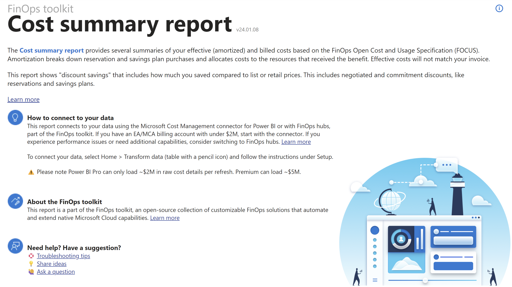
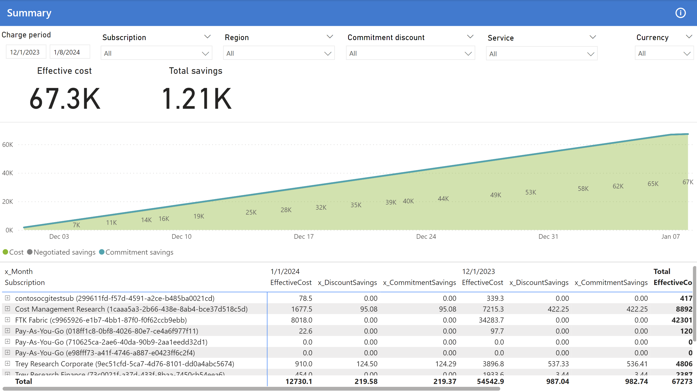
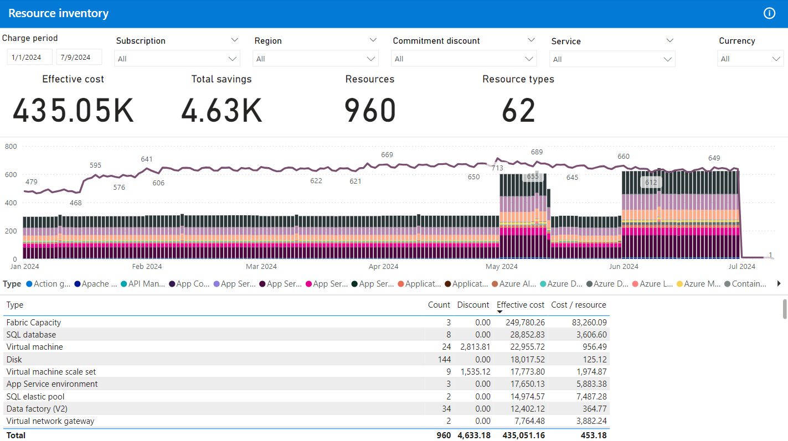
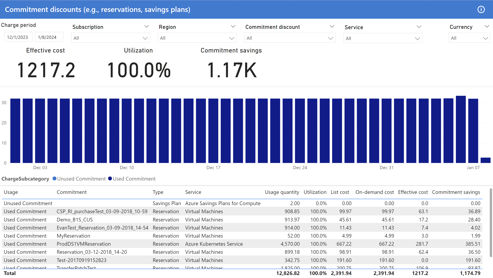
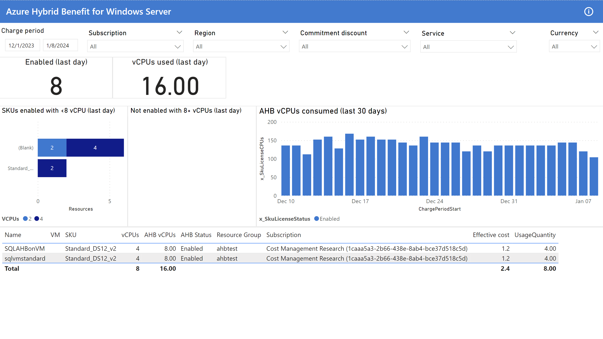

<!-- markdownlint-disable-next-line MD025 -->
# Cost summary report

The **Cost summary report** provides a general overview of cost and savings with a few common breakdowns that enable you to:

- Identify the top cost contributors.
- Review changes in cost over time.
- Build a chargeback report.
- Summarize cost savings from negotiated and commitment discounts.

You can download the Cost summary report from the [latest release](https://github.com/microsoft/finops-toolkit/releases/latest).

 

## Working with this report

This report includes the following filters on each page:

- Charge period (date range)
- Subscription and resource group
- Region
- Commitment (e.g., reservation, savings plan)
- Service (e.g., Virtual machines, SQL database)
- Currency

A few common KPIs you fill find in this report are:

- **Effective cost** shows the effective cost for the period with reservation purchases amortized across the commitment term.
- **Total savings** shows how much you're saving compared to list prices.

Note the currency must be single-select to ensure costs in different currencies aren't mixed.

 

## Get started

The **Get started** page includes a basic introduction to the report with additional links to learn more.

 

## Summary

The **Summary** page shows the running total (or accumulated cost) for the selected period. This is helpful in determining what your cost trends are.

The page uses the standard layout with cost, negotiated discount savings, and commitment discount savings in the chart and the subscription hierarchy with resource groups and resources in the table.

 

## Services

The **Services** page offers a breakdown of cost by service. This is useful for determining how service usage changes over time at a high level, usually across multiple subscriptions or the entire billing account.

The page uses the standard layout with a breakdown of services (meter category) in the chart and table. The table has a further breakdown by tier (meter subcategory), meter, and product.

 

## Subscriptions

The **Subscriptions** page includes a breakdown of cost by subscription. This is useful for building a chargeback report and determining which departments/teams/environments (depending on how you use subscriptions) are accruing the most cost.

The page uses the standard layout with a breakdown of subscriptions in the chart and table. The table has a further breakdown by resource group and resource.

 

## Resource groups

The **Resource groups** page includes a breakdown of cost by resource group. This is useful for building a chargeback report and determining which teams/projects (depending on how you use resource groups) are accruing the most cost.

The page uses the standard layout with a breakdown of resource groups in the chart and table. The table has a further breakdown by resource.

 

## Resources

The **Resources** page includes a breakdown of cost by resource. This is useful for determining which resources are accruing the most cost.

The page uses the standard layout with a breakdown of resources in the chart and table. Instead of a hierarchy, The table includes columns about the resource location, resource group, subscription, and tags.

 

## Regions

The **Regions** page includes a breakdown of cost by region with a map showing the cost from each region. The map shows approximate locations and is not exact.

<blockquote class="note" markdown="1">
   _Regions in the Cost Management FOCUS dataset include additional data cleansing for consistency with Azure regions and may not match the exact values in actual and amortized datasets._
</blockquote>

 

## Inventory

The **Inventory** page includes a list of resource types with the count, total cost, and cost per resource for each type.

 

## Commitments

<!-- NOTE: This page is duplicated in the rate-optimization.md. Please keep both updated at the same time. -->

The **Commitments** page serves 3 primary purposes:

1. Determine if there are any under-utilized commitments.
2. Facilitate chargeback at a subscription, resource group, or resource level.
3. Summarize cost savings obtained from commitment discounts.

This page uses the standard layout with a breakdown of commitment discounts in the chart and table.

In addition to cost and savings KPIs, there is also a utilization KPI for the amount of commitment discounts that have been utilized during the period. Low utilization will result in lost savings potential, so this number is one of the most important KPIs on the page.

The chart breaks down the cost of used (utilized) vs. unused charges. Unused charges are split out by commitment type (e.g., reservation, savings plan).

The table shows resource usage against commitment discounts with columns for resource name, resource group, subscription, and commitment. Use the table for chargeback and savings calculations.

This page filters usage down to only show charges related to commitment discounts, which means the total cost on the Commitments page won't match other pages, which aren't filtered by default.

 

## Hybrid Benefit

The **Hybrid Benefit** page shows Azure Hybrid Benefit (AHB) usage for Windows Server virtual machines (VMs).

KPIs show how many VMs are using Azure Hybrid Benefit and how many vCPUs are used.

There are 3 charts on the page:

1. SKU names and number of VMs currently using less than 8 vCPUs. These are under-utilizing AHB.
2. SKU names and number of VMs with 8+ vCPUs that are not currently using AHB.
3. Daily breakdown of AHB and non-AHB usage (excluding those where AHB is not supported).

The table shows a list of VMs that are currently using or could be using AHB with their vCPU count, AHB vCPU count, resource group, subscription, cost and quantity.

 

## Prices

<!-- NOTE: There is a similar page in the cost-summary.md file. They are not identical. Please keep both updated at the same time. -->

The **Prices** page shows the prices for all products that were used during the period.

The chart shows a summary of the meters that were used the most.

 

## Purchases

The **Purchases** page shows a list of products that were purchased during the period.

> 

 

## Charge breakdown

The **Charge breakdown** page shows a breakdown of all charges using the following information hierarchy:

1. ChargeCategory
2. ChargeSubcategory
3. PricingCategory
4. x_PricingSubcategory
5. ServiceCategory
6. ServiceName
7. x_SkuMeterCategory
8. x_SkuMeterSubcategory
9. x_SkuMeterName
10. SubAccountName
11. x_ResourceGroupName
12. ResourceName

> 

 

## Raw data

The **Raw data** page shows a table with most columns to help you explore FOCUS columns.

> 

 

## DQ

The **Data quality** page is for data validation purposes only; however, it can be used to explore charge categories, pricing categories, services, and regions.

> 

 

## Related content

Related resources:

- [What is FOCUS?](../../focus/what-is-focus.md)

<!-- TODO: Uncomment when files are added
- [Common terms](../../_resources/terms.md)
- [Data dictionary](../../_resources/data-dictionary.md)
-->

Related FinOps capabilities:

- [Reporting and analytics](../../framework/understand/reporting.md)

Related products:

- [Cost Management](/azure/cost-management-billing/costs/)

Related solutions:

- [FinOps hubs](../hubs/finops-hubs-overview.md)
- [FinOps toolkit open data](../open-data.md)

 

## Looking for more?

We'd love to hear about any reports, charts, or general reporting questions you're looking to answer. Create a new issue with the details that you'd like to see either included in existing or new reports.

[Share feedback](https://aka.ms/ftk/idea)

 
