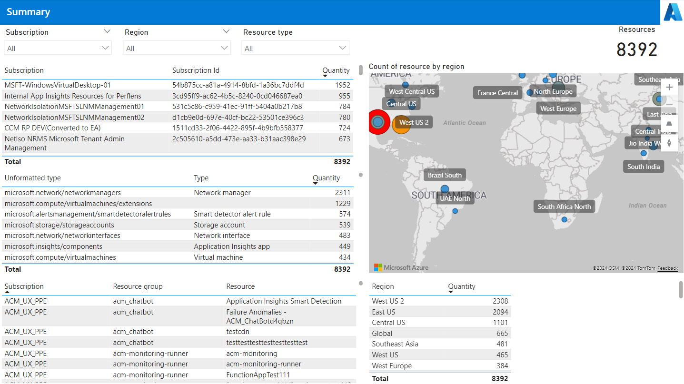
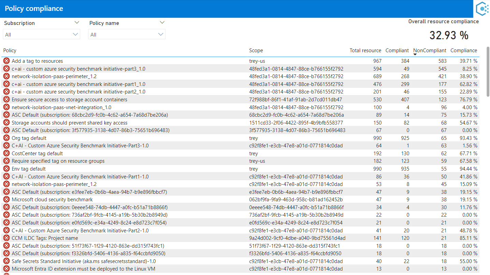

<!-- markdownlint-disable-next-line MD025 -->
# Governance report

The **Governance report** provides insights into resource utilization and efficiency opportunities based on historical usage patterns. This report enables you to:

- Identify unattached disks.

Overview of the Cloud Adoption Framework

The CAF Govern methodology provides a structured approach for establishing and optimizing cloud governance in Azure. The guidance is relevant for organizations across any industry. It covers essential categories of cloud governance, such as regulatory compliance, security, operations, cost, data, resource management, and artificial intelligence (AI).
Cloud governance is how you control cloud use across your organization. Cloud governance sets up guardrails that regulate cloud interactions. These guardrails are a framework of policies, procedures, and tools you use to establish control. Policies define acceptable and unacceptable cloud activity, and the procedures and tools you use ensure all cloud usage aligns with those policies. Successful cloud governance prevents all unauthorized or unmanaged cloud usage.
To assess your transformation journey, try the [governance benchmark tool](/assessments/b1891add-7646-4d60-a875-32a4ab26327e/?WT.mc_id=FinOpsToolkit).

This report pulls data from:

- Cost Management exports or FinOps hubs
- Azure Resource Graph

You can download the Governance report from the [latest release](https://aka.ms/ftk/latest).

> [!NOTE]
> The Governance report is new and still being fleshed out. We will continue to expand capabilities in each release in alignment with the [Cost optimization workbook](../optimization-workbook/cost-optimization-workbook.md). To request additional capabilities, please [create a feature request](https://aka.ms/ftk/ideas) in GitHub.

 

## Get started

The **Get started** page includes a basic introduction to the report with additional links to learn more.

 

## Summary

The **Summary** page provides a summary of subscriptions, resource types, resources, and regions across your environment.

 

## Policy compliance

The **Policy compliance** page lists policies configured in Azure Policy for the selected subscriptions.

 

## Virtual machines

The **Virtual machines** page lists the virtual machines, disks, and public IP addresses with related right-sizing recommendations.

 

## Managed disks

The **Managed disks** page lists the managed disks.

 

## SQL databases

The **SQL databases** page lists the SQL databases.

The chart shows the cost of each disk over time. The table shows the disks with related properties, including billed and effective cost and the dates the disk was available during the selected date range in the Charge period filter at the top-left of the page.

 

## Network security groups

The **Network security groups** page lists network security groups and NSG rules.

 

<!-- TODO: Uncomment when files are added
## See also

- [Common terms](../../_resources/terms.md)
- [Data dictionary](../../_resources/data-dictionary.md)

 
-->

## Looking for more?

We'd love to hear about any reports, charts, or general reporting questions you're looking to answer. Create a new issue with the details that you'd like to see either included in existing or new reports.

[Share feedback](https://aka.ms/ftk/idea)

 
