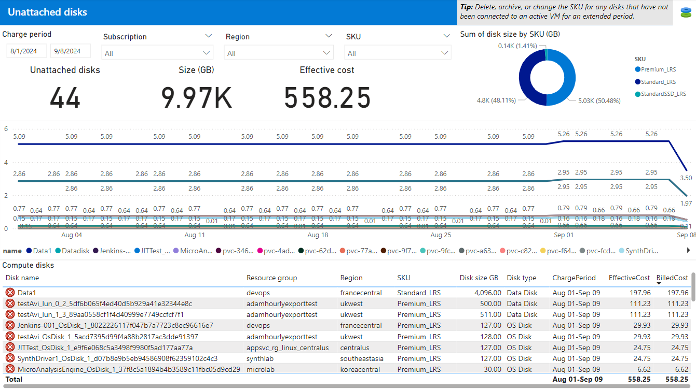

<!-- markdownlint-disable-next-line MD025 -->
# Workload optimization report

The **Workload optimization report** provides insights into resource utilization and efficiency opportunities based on historical usage patterns. This report enables you to:

- Identify unattached disks.

This report pulls data from:

- Cost Management exports or FinOps hubs
- Azure Resource Graph

You can download the Workload optimization report from the [latest release](https://github.com/microsoft/finops-toolkit/releases).

> [!NOTE]
> The Workload optimization report is new and still being fleshed out. We will continue to expand capabilities in each release in alignment with the [Cost optimization workbook](../optimization-workbook/cost-optimization-workbook.md). To request additional capabilities, please [create a feature request](https://aka.ms/ftk/ideas) in GitHub.

 

## Get started

The **Get started** page includes a basic introduction to the report with additional links to learn more.

 

## Recommendations

The **Recommendations** page provides a list of Azure Advisor cost recommendations, similar to what you will find in the Azure portal. There are currently no details available. Details will be added in a future release.

 

## Unattached disks

The **Unattached disks** page lists the unattached disks sorted by cost.

The chart shows the cost of each disk over time. The table shows the disks with related properties, including billed and effective cost and the dates the disk was available during the selected date range in the Charge period filter at the top-left of the page.

 

<!-- TODO: Uncomment when files are added
## See also

- [Common terms](../../_resources/terms.md)
- [Data dictionary](../../_resources/data-dictionary.md)

 
-->

## Looking for more?

We'd love to hear about any reports, charts, or general reporting questions you're looking to answer. Create a new issue with the details that you'd like to see either included in existing or new reports.

[Share feedback](https://aka.ms/ftk/idea)

 
