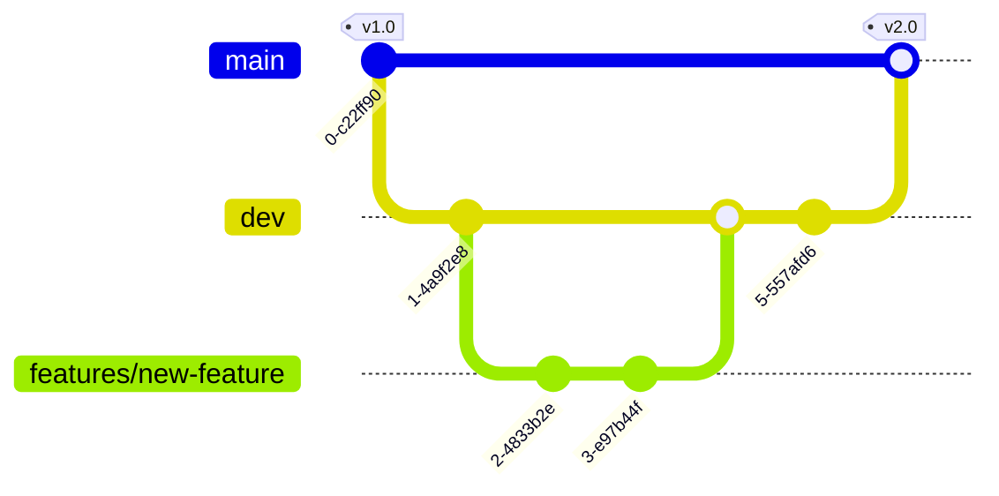

<!-- markdownlint-disable MD041 -->

- [main](../tree/main) includes the latest stable release.
- [dev](../tree/dev) includes the latest changes that will go into the next release.
- Feature branches (`features/<feature-name>`) are used for any in-progress features that are not yet ready for release.
- Personal branches (`<your-github-account>/<feature-name>`) are intended for a single developer and typically not shared. Use these for small changes that can easily be integrated into the next release.

On this page:

- [🌟 Important branches](#-important-branches)
- [💡 Tips for external contributors](#-tips-for-external-contributors)
- [💡 Tips for Microsoft contributors](#-tips-for-microsoft-contributors)

---

## 🌟 Important branches

- `main` is for released versions. Do not work in this branch.
- `dev` is for the next release. All PRs to this branch must meet the following requirements:
  - Changes must be complete and validated. No partial commits.
  - Applicable documentation in [docs](../tree/dev/docs) must be updated.
  - External-facing changes must be covered in the [changelog](../tree/dev/docs-mslearn/toolkit/changelog.md).
- `features/workbookv2` is for the Cost optimization workbook's next release. Target version: `0.1` (TBD).
- `features/governance` is for a new Governance workbook. Target version: `0.1` (TBD).
- `features/powershell` is for PowerShell automation. Target version: `0.1.*`.
- `features/exports` is for FinOps hubs managed exports. Target version: `0.2`.
- `features/focus` is for FinOps hubs FOCUS adoption. Target version: `0.3`.
- `features/adx` is for FinOps hubs Azure Data Explorer ingestion. Target version: `0.4`.

 

## 💡 Tips for external contributors

External contributors will always start by forking the repo.

If contributing to an in-progress feature, switch to the feature branch and submit a PR back to the main repo's feature branch.

If contributing a new feature, switch to the `dev` branch and submit a PR back to the main repo's `dev` branch. You are free to invite others to contribute within your fork as needed.

If you run into any issues, please reach out to us on [Discussions](../discussions). We're happy to help!

 

## 💡 Tips for Microsoft contributors

If planning a new feature that will require work from multiple developers (Microsoft or external), create a feature branch.

We encourage all developers to submit PRs against feature branches to ensure everyone is on the same page with what's committed and avoid breaking each other. This is optional and not enforced however.

If working on a single-commit change, you are free to create a personal dev branch (`<your-github-account>/<feature-name>`) and submit a PR from there.

Note that all branches are automatically deleted after a PR is merged to `dev`.

 
