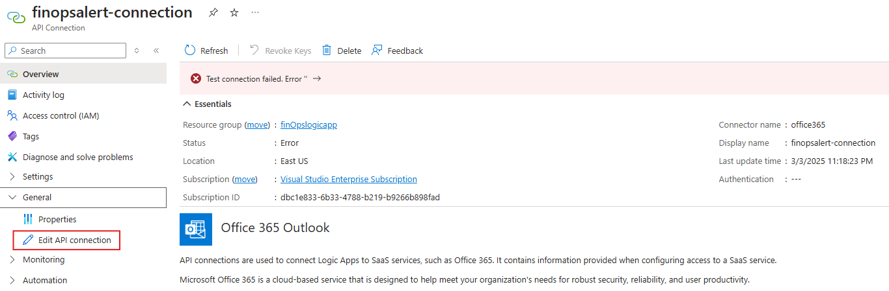
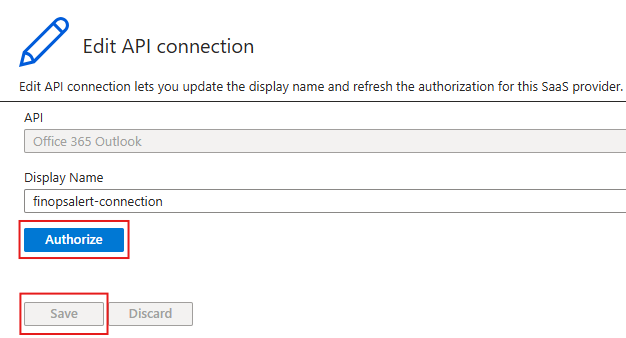
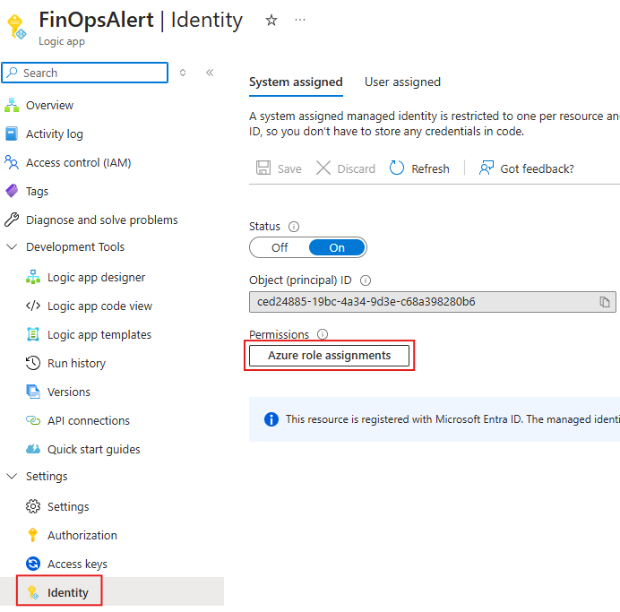
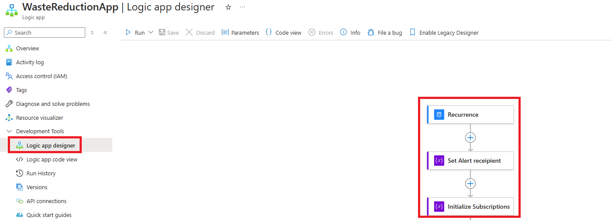

# FinOps Alert

**FinOps Alert** is an automated detection mechanism powered by [Azure Logic Apps](https://docs.microsoft.com/azure/logic-apps/logic-apps-overview). The logic app will run on a configurable schedule to monitor selected subscriptions for a set of idle resources and send notifications once it finds any of those resources to alert admins to investigate and take action.

Use the following steps to deploy FinOps Alert

1. Create a new **Deployment**
    > [!IMPORTANT]
    > The logic app needs to be in the same region as its resource group

   * Verify the deployment is successful

2. Authorize Connection
    > [!NOTE]
    > After the deployment is complete, the API connection will have an error. This is expected and will be fixed after authorizing the connection

   * Select the **API connection** resource, then select **Edit API Connection** in the General tab to authorize the connection

    

   * Select **Authorize**

     
  
    > [!IMPORTANT]
    > The account authorizing the connection will be used by the Logic app to send the Alerts

   * Select **Save** after the authorization is successful

    

   * Go back to the **Overview** blade and verify that the **Status: Connected**

3. Add a role assignemnt to the system-assigned identity to allow the Logic App to "read" the resources in the subscription(s)

   * Select the **Logic app**
   * Select **Identity** under the Settings tab and and select **Azure role assignments**

    

   * Go to **Azure role assignments** within the *system assigned* blade
   * Select **Add role assignment** and assign the following permissions then select **Save**
      * Scope: Subscription
      * Subscription: Subscription to be analyzed by this Logic App
      * Role: Reader
   * If you have a management group scope you want to monitor that contains multiple subscriptions, follwow these insctructions,
       * Select the management group where you would want to assign the role.
       * Go to the "Access Control (IAM)" section of the management group
       * Click on "Add" and then "Add role assignment."
       * Select the "Reader" role from the list of roles.
       * Assign the role to the Logic App's managed identity.
       * Confirm and save the role assignment. The Reader role will now be applied at the management group level.

4. Configure the Logic App

   * Navigate to **FinOpsAlert** and select **Logic app designer** under the Development Tools tab
   * Configure the **Reoccurrence** - Default value: 1 week
   * Set the **email subject and alert recipient**
   * Set the subscription IDs within **Initialize subscriptions** in scope
     * If you have any subscriptionIds you would like to filter the query with configure **Included subscriptions** variable.
     * If you have any subscriptionIds you would like to excluded querying against configure **Excluded subscriptions** variable.

      

    

   > [!NOTE]
   > If you have multiple subscriptions, you can add the IDs to the array, by using the following format: ["subscriptionID1", "subscriptionID2", "subscriptionID3"]

5. Test Logic App

   * Select **Run** to test the Logic App
