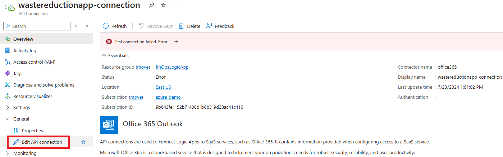
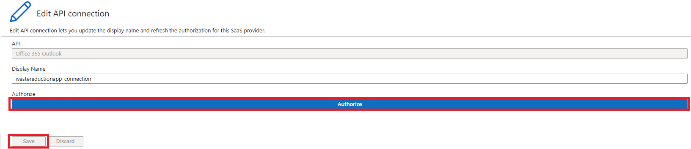
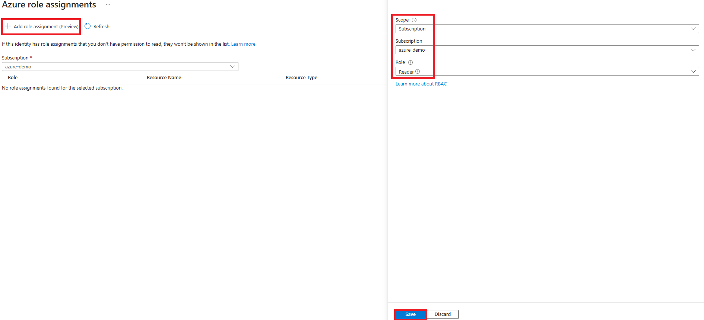
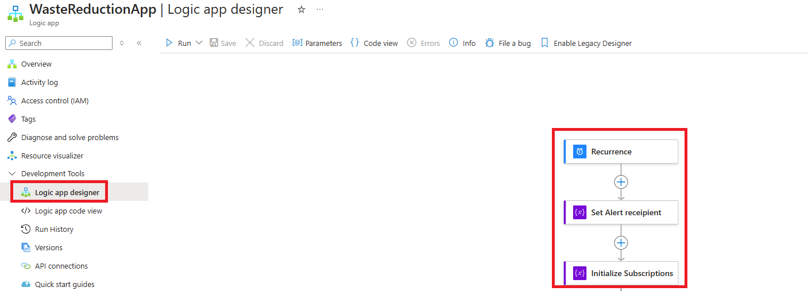

# Automated detection

The **Waste Reduction Logic App** is an automated detection mechanism provided by [Azure Logic App](https://docs.microsoft.com/en-us/azure/logic-apps/logic-apps-overview). The logic app will run on a configurable schedule to monitor selected subscriptions for a set of idle resources and send notifications once it finds any of those resources to alert admins to investigate and take action.

Use the following steps to deploy the Logic App

1. Create a new **Custom Deployment**
    > [!IMPORTANT]
    > The logic app needs to be in the same region as its resource group
   * Navigate to **Deploy a custom template** and select **Build your own template in the editor**
   * You will see a blank template.
   * You can either load the Bicep file "**Waste Reduction Logic App**" or replace the blank template with the code.
   * Select  **Save**.
   * Then select  **Review + create**
   * After the portal validates the template, select  **Create**.

2. Authorize Connection
    > [!NOTE]
    > After the deployment is complete, the API connection will have an error. This is expected and will be fixed after authorizing the connection.  

   * Select the **API connection** resource, then select **Edit API Connection** in the General tab to authorize the connection.
    
   * Select **Authorize**

    <br>
  
    > [!IMPORTANT]
    > The account authorizing the connection will be used by the Logic App to send the Alerts.

   * Select **Save** after the authorization is successful
    
   * Go back to the **Overview** blade and verify that the **Status: Connected**

3. Create a system-assigned identity to allow the Logic App to "read" the resources in the subscription.

   * Select the **WasteReductionApp**
   * Select **Identity** under the Settings tab and toggle the Status to **On**
   * **Save** your changes and select **yes** to enable the system assigned managed identity
    
   * Go to **Azure role assignments** within the *system assigned* blade
   * Select **Add role assignment** and assign the following permissions then select **Save**
  
     ```text

      Scope: Subscription

      Subscription: Subscription to be analyzed by this Logic App

      Role: Reader

      ```

     

4. Configure the Logic App

   * Navigate to the **WasteReductionApp** and select **Logic App Designer** under the Development Tools tab
   * Configure the **reoccurrence**
   * Configure the **alert recipient email**
   * Set **subscription IDs** in scope
    

   <br>

   > [!NOTE]
   > If you have multiple subscriptions, you can add the IDs to the array, by using the following format: ["subscriptionID1", "subscriptionID2", "subscriptionID3"]

5. Test Logic App

   * Select **Run** to test the Logic App
