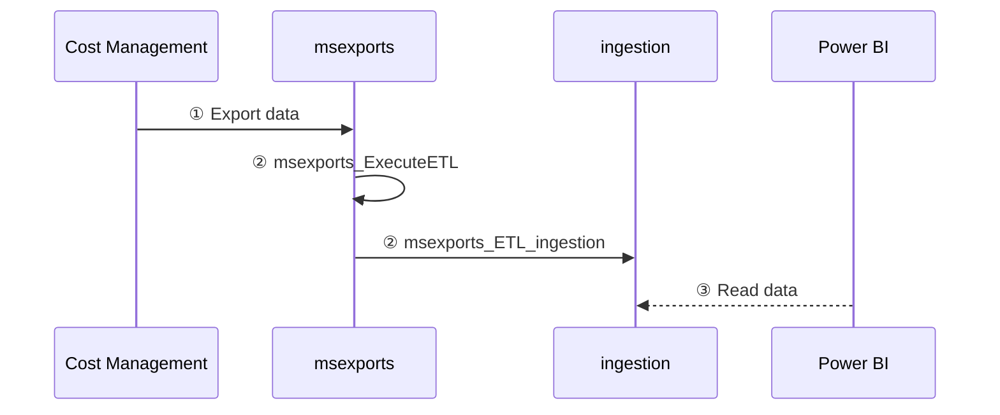

<span class="fs-9 d-block mb-4">How data is processed in FinOps hubs</span>
From data cleanup to normalization, FinOps hubs do the work so you can focus on driving business value.
{: .fs-6 .fw-300 }

<details open markdown="1">
   <summary class="fs-2 text-uppercase">On this page</summary>

- [ℹ️ About ingestion](#ℹ️-about-ingestion)
- [ℹ️ About exports](#ℹ️-about-exports)
- [⏭️ Next steps](#️-next-steps)

</details>

---

FinOps hubs perform a number of data processing activities to clean up, normalize, and optimize data. The following diagram shows how data flows from Cost Management into a hub instance:



<br>

1. Cost Management exports raw cost details to the **msexports** container. [Learn more](#ℹ️-about-exports).
2. The **msexports_ExecuteETL** pipeline kicks off the extract-transform-load (ETL) process when files are added to storage.
3. The **msexports_ETL_ingestion** pipeline saves exported data in parquet format in the **ingestion** container. [Learn more](#ℹ️-about-ingestion).
4. Power BI reads cost data from the **ingestion** container.

<br>

## ℹ️ About ingestion

FinOps hubs rely on a specific folder path in the **ingestion** container:

```text
ingestion/{scope-id}/{month}/focuscost
```

- `ingestion` is the container where the data pipeline saves data.
- `{scope-id}` is expected to be the fully-qualified resource ID of the scope the data is from.
- `{month}` is the year and month of the exported data formatted as `yyyyMM`.
- `focuscost` is the exported dataset.
  > Hubs 0.2 only supports FOCUS cost exports. Other export types will be added in a future release.

If you need to use hubs to monitor non-Azure data, convert the data to [FOCUS](../../_docs/focus/README.md) and drop it into the **ingestion** container. Please note this has not been explicitly tested in the latest release. If you experience any issues, please [create an issue](https://aka.ms/finops/toolkit/ideas).

<br>

## ℹ️ About exports

FinOps hubs leverage Cost Management exports to obtain cost data. Cost Management controls the folder structure for the exported data in the **msexports** container. A typical path looks like:

```text
{container}/{path}/{date-range}/{export-name}/{export-time}/{guid}/{file}
```

For FinOps hubs, we expect the following:

```text
msexports/{scope-id}/{date-range}/{export-name}/{export-time}/{guid}/{file}
```

- `msexports` is the container specified on the export.
  > Hubs only monitor the **msexports** container, so this is required.
- `{scope-id}` is the folder path specified on the export.
  > Hubs use this to identify which scope the data is coming from. We recommend using the scope ID but any value can be used. Example scope IDs include:
  >
  > | Scope type      | Example value                                                          |
  > | --------------- | ---------------------------------------------------------------------- |
  > | Subscription    | `/subscriptions/###`                                                   |
  > | Resource group  | `/subscriptions/###/resourceGroups/###`                                |
  > | Billing account | `/providers/Microsoft.Billing/billingAccounts/###`                     |
  > | Billing profile | `/providers/Microsoft.Billing/billingAccounts/###/billingProfiles/###` |
- `{export-name}` is the name of the export.
  > Hubs ignore this folder.
- `{date-range}` is the date range data being exported.
  > Hubs use this to identify the month. Format for this folder is `yyyyMMdd-yyyyMMdd`.
- `{export-time}` is a timestamp of when the export ran.
  > Hubs ignore this. Format for this folder is `yyyyMMddHHmm`.
- `{guid}` is a unique GUID and is not always present.
  > Hubs ignore this. Cost Management does not always include this folder. Whether or not it is included depends on the API version used to create the export.
- `{file}` is either a manifest or exported data.
  > Hubs 0.2 ignores manifest files and only monitors `*.csv` files. In a future release, hubs will monitor the manifest.

<br>

---

## ⏭️ Next steps

<br>

[Deploy](./README.md#-create-a-new-hub){: .btn .btn-primary .mt-2 .mb-4 .mb-md-0 .mr-4 }
[Learn more](./README.md#-why-finops-hubs){: .btn .mt-2 .mb-4 .mb-md-0 .mr-4 }

<br>
