```mermaid
sequenceDiagram
    config->>config: ① config_SettingsUpdated
    config->>config: ② config_ConfigureExports
    config->>Cost Management: ② PUT .../exports/foo
```

```mermaid
sequenceDiagram
    config->>config: ① config_Daily/MonthlySchedule
    config->>config: ② config_ExportData
    config->>config: ③ config_RunExports
    config->>Cost Management: ③ POST /exports/foo/run
    Cost Management->>msexports: ④ Export data
    msexports->>msexports: ⑤ msexports_ExecuteETL
    msexports->>ingestion: ⑥ msexports_ETL_ingestion
    Power BI-->>ingestion: ⑦ Read data
```

<span class="fs-9 d-block mb-4">How data is processed in FinOps hubs</span>
From data cleanup to normalization, FinOps hubs do the work so you can focus on driving business value.
{: .fs-6 .fw-300 }

<details open markdown="1">
   <summary class="fs-2 text-uppercase">On this page</summary>

- [🛠️ Scope setup](#️-scope-setup)
- [📥 Data ingestion](#-data-ingestion)
- [ℹ️ About Data Explorer ingestion](#ℹ️-about-data-explorer-ingestion)
- [ℹ️ About the ingestion container](#ℹ️-about-the-ingestion-container)
- [ℹ️ About exports](#ℹ️-about-exports)
- [🗃️ FinOps hubs v0.6](#️-finops-hubs-v06)
- [🗃️ FinOps hubs v0.4-0.5](#️-finops-hubs-v04-05)
- [🗃️ FinOps hubs v0.2-0.3](#️-finops-hubs-v02-03)
- [🗃️ FinOps hubs v0.1](#️-finops-hubs-v01)
- [⏭️ Next steps](#️-next-steps)

</details>

---

FinOps hubs perform a number of data processing activities to clean up, normalize, and optimize data. The following diagrams show how data flows from Cost Management into a hub instance.

<br>

## 🛠️ Scope setup

This diagram shows what happens when a new, managed scope is added to a hub instance. Unmanaged scopes (where Cost Management exports are manually configured) do not require any setup in hubs.



<br>

1. The **config_SettingsUpdated** trigger runs when the **settings.json** file is updated.
2. The **config_ConfigureExports** pipeline creates new exports for any new scopes that were added.

<br>

## 📥 Data ingestion

The following depicts the end-to-end data ingestion process within FinOps hubs:

1. (Optional) If using managed exports:
   1. The **config_DailySchedule** and **config_MonthlySchedule** triggers run on their respective schedules to kick off data ingestion.
   2. The **config_StartExportProcess** pipeline gets the applicable exports for the schedule that is running.
   3. The **config_RunExportJobs** pipeline executes each of the selected exports.
2. Cost Management exports raw cost details to the **msexports** container. [Learn more](#ℹ️-about-exports).
3. The **msexports_ExecuteETL** pipeline queues the extract-transform-load (ETL) pipeline when files are added to the **msexports** container.
4. The **msexports_ETL_ingestion** pipeline transforms the data to parquet format and moves it to the **ingestion** container using a scalable file structure. [Learn more](#ℹ️-about-the-ingestion-container).
5. (Optional) If using Azure Data Explorer:
   1. The **ingestion_ExecuteETL** pipeline queues the Data Explorer ingestion pipeline when files are added to the **ingestion** container.
   2. The **ingestion_ETL_dataExplorer** pipeline ingests data into the `{dataset}_raw` table in the Data Explorer.
      - The dataset name is the first folder in the **ingestion** container.
      - All raw tables are in the **Ingestion** database in Data Explorer.
   3. When data is ingested into raw tables in Data Explorer, an update policy copies the data into the corresponding `{dataset}_final_v1_0` table using the `{dataset}_transform_v1_0()` function to normalize all data to align to FOCUS 1.0.
   4. After ingestion, the **ingestion_ETL_dataExplorer** pipeline performs some cleanup, including purging data in the final table that is past the data retention period.
      - As of 0.7, data retention in raw tables is applied automatically by Data Explorer, but data retention in final tables is only applied when ingestion is run. If data ingestion stops, historical data will not be purged.
      - Data retention can be configured during the template deployment or manually in the **config/settings.json** file in storage.
6. Reports and other tools like Power BI read data from Data Explorer or the **ingestion** container.
   - Data in Data Explorer can be read from the **Hub** database.
     - Use the `{dataset}()` function to leverage the latest schema.
       - This is useful for quick exploration, but may introduce breaking changes as the FinOps hub instance is updated.
     - Use the `{dataset}_v1_0()` function to leverage the FOCUS 1.0 schema.
       - Versioned function schemas should not change over time but values may change if the data source changes those values.
     - Avoid using the **Ingestion** database for queries. While not explicitly prohibited, this should be mostly considered an internal area for staging and data preparation.
   - Data in storage can be read from `ingestion/<dataset>/<year>/<month>/<scope-path>`.
     - Data should be read recursively from the dataset folder and optionally including more as needed for specificity.
     - Files in each dataset folder may have different schemas based on the data source and account type. Be prepared to transform data if ingesting in other systems, like Microsoft Fabric.
     - Reading from storage is generally discouraged due to performance reasons.

<br>

## ℹ️ About Data Explorer ingestion

When data is ingested into Data Explorer, there are a number of transforms that take place in the respective `{dataset}_transform_v1_0()` functions in the **Ingestion** database. Each dataset has a different set of transform rules covered in the following sections.

For a list of requested changes, ideas under consideration, and open questions about the underlying Cost Management datasets, see [issue #1111](https://github.com/microsoft/finops-toolkit/issues/1111). Please leave comments on that issue if you find opportunities to address any additional concerns or to voice your support for any of the specific issues.

### Cost data transforms

Supported datasets:

- Microsoft FocusCost: `1.0r2`, `1.0`, `1.0-preview(v1)`

The following datasets were accounted for in the design, but have not been tested. To ingest these datasets, create a data pipeline (or external process) that pushes parquet files into the `ingests/Costs/yyyy/mm/{scope-path}` folder in storage.

- AWS FOCUS 1.0
- GCP FOCUS 1.0
- OCI FOCUS 1.0

Transforms:

1. Align column names to FOCUS 1.0.
   - Includes converting FOCUS 1.0 preview to 1.0.
2. Add `x_IngestionTime` to indicate when the row was last updated.
3. Add `x_SourceChanges` to identify when data in a row has been changed in hubs.
4. Update `ProviderName` and `PublisherName` when not specified.
5. Add `x_SourceName`, `x_SourceProvider`, `x_SourceType`, and `x_SourceVersion` to identify the original ingested dataset.
6. Populate missing `ListCost`, `ListUnitPrice`, `ContractedCost`, and `ContractedUnitPrice` values based on the price sheet.
   - This process requires prices to be exported before the cost. This may result in prices being missing for the first day of the month until prices are ingested.
7. Fix `ContractedCost` when it's set incorrectly due to a bug in Cost Management.
8. Lowercase `ResourceName` and `x_ResourceGroupName` to address casing consistency issues that break grouping and filtering.
9. Add `x_BillingAccountAgreement` based on the account type.

### Price data transforms

Supported datasets:

- Microsoft PriceSheet: `2023-05-01` (EA and MCA)

Transforms:

1. Align column names to FOCUS 1.0.
   - Includes enforcing EA and MCA column name consistency.
   - Does not change the underlying values, which may differ across EA and MCA.
2. Convert `x_SkuTerm` ISO duration to a number of months to match cost details.
   - We are waiting for FOCUS to make a determination for how to define durations before changing this to ISO or another format.
3. Replace `ContractedUnitPrice` for savings plan usage with the on-demand equivalent.
4. Set `ListUnitPrice` for savings plan usage set to the on-demand equivalent.
5. Add `SkuPriceIdv2` as a more accurate `SkuPriceId` value than what is currently in cost details.
6. Add `x_IngestionTime` to indicate when the row was last updated.
7. Add `x_CommitmentDiscountSpendEligibility` and `x_CommitmentDiscountUsageEligibility`.
8. Expand `x_PricingUnitDescription` into `PricingUnit` and `x_PricingBlockSize`.
9. Add `x_BillingAccountAgreement` based on the account type.
10. Change `x_EffectivePeriodEnd` to be an exclusive end date.
11. Add `x_EffectiveUnitPriceDiscount`, `x_ContractedUnitPriceDiscount`, and `x_TotalUnitPriceDiscount` to summarize available discounts per SKU.
12. Add `x_EffectiveUnitPriceDiscountPercent`, `x_ContractedUnitPriceDiscountPercent`, and `x_TotalUnitPriceDiscountPercent` to summarize the percentage of the discount per SKU.
13. Add `x_SourceName`, `x_SourceProvider`, `x_SourceType`, and `x_SourceVersion` to identify the original ingested dataset.

### Recommendation data transforms

Supported datasets:

- Microsoft ReservationRecommendations: `2023-05-01` (EA and MCA)

Transforms:

1. Align column names to FOCUS 1.0.
   - Includes enforcing EA and MCA column name consistency.
   - Does not change the underlying values, which may differ across EA and MCA.
2. Add `x_SourceName`, `x_SourceProvider`, `x_SourceType`, and `x_SourceVersion` to identify the original ingested dataset.

### Transaction data transforms

Supported datasets:

- Microsoft ReservationTransactions: `2023-05-01` (EA and MCA)

Transforms:

1. Align column names to FOCUS 1.0.
   - Includes enforcing EA and MCA column name consistency.
   - Does not change the underlying values, which may differ across EA and MCA.
2. Add `x_SourceName`, `x_SourceProvider`, `x_SourceType`, and `x_SourceVersion` to identify the original ingested dataset.

### Commitment discount usage data transforms

Supported datasets:

- Microsoft ReservationDetails: `2023-03-01` (EA and MCA)

Transforms:

1. Align column names to FOCUS 1.0.
   - Includes enforcing EA and MCA column name consistency.
   - Does not change the underlying values, which may differ across EA and MCA.
2. Add `ResourceType` column with the resource type display name.
3. Add `ServiceName`, `ServiceCategory`, and `x_ServiceModel` columns.
4. Replace "NA" will null for `x_CommitmentDiscountNormalizedGroup`.
5. Add `x_CommitmentDiscountQuantity` based on FOCUS 1.1.

<br>

## ℹ️ About the ingestion container

FinOps hubs rely on a specific folder path and file name format in the **ingestion** storage container:

```text
ingestion/{dataset}/{date-folder-path}/{scope-id-path}/{ingestion-id}__{original-file-name}.parquet
```

- `ingestion` is the container where the data pipeline saves data.
- `{dataset}` is the exported dataset type. If ingesting into Azure Data Explorer, this must have a matching, case-sensitive "_raw" table (e.g., "Costs_raw"). FinOps hubs supports the following datasets in this release:
  - **CommitmentDiscountUsage** - Cost Management reservation details export.
  - **Costs** - FOCUS cost and usage data.
  - **Prices** - Cost Management price sheet export.
  - **Recommendations** - Cost Management reservation recommendations export.
  - **Transactions** - Cost Management reservation transactions export.
  - To ingest custom datasets, create a matching `{dataset}_raw` table and parquet ingestion mapping in the **Ingestion** database.
- `{date-folder-path}` can be one or more folders that indicate how many ingested datasets should be retained. Examples:
  - `all` (or any placeholder) to not track history for the dataset. Every ingestion will replace the previous data. Not supported in storage-based Power BI reports.
  - `{yyyy}` as a 4-digit year of the exported dataset to only retain the latest ingestion per year. Not supported in storage-based Power BI reports.
  - `{yyyy}/{mm}` as a 4-digit year and 2-digit month of the exported dataset to retain the latest ingestion per month.
  - `{yyyy}/{mm}/{dd}` as a 4-digit year, 2-digit month, and 2-digit day of the exported dataset to retain the latest ingestion per day. Not supported in storage-based Power BI reports.
- `{scope-id-path}` is the fully-qualified resource ID of the scope the data is from. If ingesting non-Azure data, we recommend using a logical hierarchy based on the scope of data (e.g., "aws/{account-id}", "gcp/{project-name}", "oci/{component-id}/{component-id}").
- `{ingestion-id}` is a unique ID for the ingested dataset. This can be a GUID, a timestamp, or any value as long as it is consistent across all files for the ingested dataset. This value is used to remove previously ingested data in the same folder path.
- `{original-file-name}` is intended to be the original file name or other identifier to indicate where the data in the file originated. This value is for your troubleshooting purposes only.

The full folder path and ingestion ID are both used to ensure data is not duplicated in storage or in Azure Data Explorer. The original file name is added to Azure Data Explorer extents for troubleshooting purposes, but is not otherwise tracked or used by FinOps hubs.

If you need to use hubs to monitor non-Azure data, convert the data to [FOCUS](../../_docs/focus/README.md) and drop it into the **ingestion** container using the guidance above. Please note this has not been explicitly tested in the latest release. If you experience any issues, please [create an issue](https://aka.ms/ftk/idea).

<br>

## ℹ️ About exports

FinOps hubs leverage Cost Management exports to obtain cost data. Cost Management controls the folder structure for the exported data in the **msexports** storage container. A typical path looks like:

```text
{container}/{path}/{date-range}/{export-name}/{export-time}/{guid}/{file}
```

FinOps hubs utilize the manifest file to identify the scope, dataset, month, etc. The only important part of the path for hubs is the container, which must be **msexports**.

<blockquote class="warning" markdown="1">
  _Do not export data to the **ingestion** container. Exported CSVs **must** be published to the **msexports** container to be processed by the hubs engine._
  
  _To ingest custom data, save FOCUS-aligned parquet files in the **ingestion** container for the FinOps toolkit Power BI reports to work as expected._
</blockquote>

Export manifests can change with API versions. Here's an example with API version `2023-07-01-preview`:

```json
{
  "exportConfig": {
    "exportName": "<export-name>",
    "resourceId": "/<scope>/providers/Microsoft.CostManagement/exports/<export-name>",
    "dataVersion": "<dataset-version>",
    "apiVersion": "<api-version>",
    "type": "<dataset-type>",
    "timeFrame": "OneTime|TheLastMonth|MonthToDate",
    "granularity": "Daily"
  },
  "deliveryConfig": {
    "partitionData": true,
    "dataOverwriteBehavior": "CreateNewReport|OverwritePreviousReport",
    "fileFormat": "Csv",
    "containerUri": "<storage-resource-id>",
    "rootFolderPath": "<path>"
  },
  "runInfo": {
    "executionType": "Scheduled",
    "submittedTime": "2024-02-03T18:33:03.1032074Z",
    "runId": "af754a8e-30fc-4ef3-bfc6-71bd1efb8598",
    "startDate": "2024-01-01T00:00:00",
    "endDate": "2024-01-31T00:00:00"
  },
  "blobs": [
    {
      "blobName": "<path>/<export-name>/<date-range>/<export-time>/<guid>/<file-name>.csv",
      "byteCount": ###
    }
  ]
}
```

FinOps hubs leverage the following properties:

- `eportConfig.resourceId` to identify the scope.
- `eportConfig.type` to identify the dataset type.
- `eportConfig.dataVersion` to identify the dataset version.
- `runInfo.startDate` to identify the exported month.

<a name="datasets"></a>FinOps hubs support the following dataset types, versions, and API versions:

- FocusCost: `1.0r2`, `1.0`, `1.0-preview(v1)`
- PriceSheet: `2023-05-01`
- ReservationDetails: `2023-03-01`
- ReservationRecommendations: `2023-05-01`
- ReservationTransactions: `2023-05-01`
- API versions: `2023-07-01-preview`

<br>

## 🗃️ FinOps hubs v0.6

The following sections explain data process in FinOps hubs 0.6.

### Scope setup in v0.6

This diagram shows what happens when a new, managed scope is added to a hub instance. Unmanaged scopes (where Cost Management exports are manually configured) do not require any setup in hubs.


<br>

1. The **config_SettingsUpdated** trigger runs when the **settings.json** file is updated.
2. The **config_ConfigureExports** pipeline creates new exports for any new scopes that were added.

<br>

### Data ingestion in v0.6

This diagram shows what happens when the daily and monthly schedules are run.


<br>

1. The **config_DailySchedule** and **config_MonthlySchedule** triggers run on their respective schedules to kick off data ingestion.
1. The **config_StartExportProcess** pipeline gets the applicable exports for the schedule that is running.
1. The **config_RunExportJobs** pipeline executes each of the selected exports.
1. Cost Management exports raw cost details to the **msexports** container. [Learn more](#about-exports-in-v06).
1. The **msexports_ExecuteETL** pipeline queues the extract-transform-load (ETL) pipeline when files are added to the **msexports** container.
1. The **msexports_ETL_ingestion** pipeline transforms the data to parquet format and moves it to the **ingestion** container using a scalable file structure. [Learn more](#about-ingestion-in-v06).
1. Power BI or other tools read data from the **ingestion** container.
   <blockquote class="note" markdown="1">
     _Power BI support for Azure Data Explorer is coming in a future update._
   </blockquote>

<br>

### About ingestion in v0.6

FinOps hubs rely on a specific folder path and file name format in the **ingestion** container:

```text
ingestion/{dataset}/{date-folder-path}/{scope-id-path}/{ingestion-id}__{original-file-name}.parquet
```

- `ingestion` is the container where the data pipeline saves data.
- `{dataset}` is the exported dataset type. If ingesting into Azure Data Explorer, this must have a matching, case-sensitive "_raw" table (e.g., "Costs_raw"). FinOps hubs supports the following datasets in this release:
  - **CommitmentDiscountUsage** - Cost Management reservation details export.
  - **Costs** - FOCUS cost and usage data.
  - **Prices** - Cost Management price sheet export.
  - **Recommendations** - Cost Management reservation recommendations export.
  - **Transactions** - Cost Management reservation transactions export.
  - To ingest custom datasets, create a matching `{dataset}_raw` table and parquet ingestion mapping in the **Ingestion** database.
- `{date-folder-path}` can be one or more folders that indicate how many ingested datasets should be retained. Examples:
  - `all` (or any placeholder) to not track history for the dataset. Every ingestion will replace the previous data. Not supported in storage-based Power BI reports.
  - `{yyyy}` as a 4-digit year of the exported dataset to only retain the latest ingestion per year. Not supported in storage-based Power BI reports.
  - `{yyyy}/{mm}` as a 4-digit year and 2-digit month of the exported dataset to retain the latest ingestion per month.
  - `{yyyy}/{mm}/{dd}` as a 4-digit year, 2-digit month, and 2-digit day of the exported dataset to retain the latest ingestion per day. Not supported in storage-based Power BI reports.
- `{scope-id-path}` is the fully-qualified resource ID of the scope the data is from. If ingesting non-Azure data, we recommend using a logical hierarchy based on the scope of data (e.g., "aws/{account-id}", "gcp/{project-name}", "oci/{component-id}/{component-id}").
- `{ingestion-id}` is a unique ID for the ingested dataset. This can be a GUID, a timestamp, or any value as long as it is consistent across all files for the ingested dataset. This value is used to remove previously ingested data in the same folder path.
- `{original-file-name}` is intended to be the original file name or other identifier to indicate where the data in the file originated. This value is for your troubleshooting purposes only.

The full folder path and ingestion ID are both used to ensure data is not duplicated in storage or in Azure Data Explorer. The original file name is added to Azure Data Explorer extents for troubleshooting purposes, but is not otherwise tracked or used by FinOps hubs.

If you need to use hubs to monitor non-Azure data, convert the data to [FOCUS](../../_docs/focus/README.md) and drop it into the **ingestion** container using the guidance above. Please note this has not been explicitly tested in the latest release. If you experience any issues, please [create an issue](https://aka.ms/ftk/idea).

<br>

### About exports in v0.6

FinOps hubs leverage Cost Management exports to obtain cost data. Cost Management controls the folder structure for the exported data in the **msexports** container. A typical path looks like:

```text
{container}/{path}/{date-range}/{export-name}/{export-time}/{guid}/{file}
```

As of 0.4, FinOps hubs do not rely on file paths. Hubs utilize the manifest file to identify the scope, dataset, month, etc. The only important part of the path for hubs is the container, which must be **msexports**.

<blockquote class="warning" markdown="1">
  _Do not export data to the **ingestion** container. Exported CSVs **must** be published to the **msexports** container to be processed by the hubs engine._
  
  _To ingest custom data, save FOCUS-aligned parquet files in the **ingestion** container for the FinOps toolkit Power BI reports to work as expected._
</blockquote>

Export manifests can change with API versions. Here's an example with API version `2023-07-01-preview`:

```json
{
  "exportConfig": {
    "exportName": "<export-name>",
    "resourceId": "/<scope>/providers/Microsoft.CostManagement/exports/<export-name>",
    "dataVersion": "<dataset-version>",
    "apiVersion": "<api-version>",
    "type": "<dataset-type>",
    "timeFrame": "OneTime|TheLastMonth|MonthToDate",
    "granularity": "Daily"
  },
  "deliveryConfig": {
    "partitionData": true,
    "dataOverwriteBehavior": "CreateNewReport|OverwritePreviousReport",
    "fileFormat": "Csv",
    "containerUri": "<storage-resource-id>",
    "rootFolderPath": "<path>"
  },
  "runInfo": {
    "executionType": "Scheduled",
    "submittedTime": "2024-02-03T18:33:03.1032074Z",
    "runId": "af754a8e-30fc-4ef3-bfc6-71bd1efb8598",
    "startDate": "2024-01-01T00:00:00",
    "endDate": "2024-01-31T00:00:00"
  },
  "blobs": [
    {
      "blobName": "<path>/<export-name>/<date-range>/<export-time>/<guid>/<file-name>.<file-type>",
      "byteCount": ###
    }
  ]
}
```

FinOps hubs leverage the following properties:

- `eportConfig.resourceId` to identify the scope.
- `eportConfig.type` to identify the dataset type.
- `eportConfig.dataVersion` to identify the dataset version.
- `runInfo.startDate` to identify the exported month.

FinOps hubs support the following dataset types, versions, and API versions:

- FocusCost: `1.0`, `1.0-preview(v1)`
- PriceSheet: `2023-05-01`
- ReservationDetails: `2023-03-01`
- ReservationRecommendations: `2023-05-01`
- ReservationTransactions: `2023-05-01`
- API versions: `2023-07-01-preview`

<br>

## 🗃️ FinOps hubs v0.4-0.5

The following sections explain data process in FinOps hubs 0.4 and 0.5.

### Scope setup in v0.4-0.5

This diagram shows what happens when a new, managed scope is added to a hub instance. Unmanaged scopes (where Cost Management exports are manually configured) do not require any setup in hubs.


1. The **config_SettingsUpdated** trigger runs when the **settings.json** file is updated.
2. The **config_ConfigureExports** pipeline creates new exports for any new scopes that were added.

### Data ingestion in v0.4-0.5

This diagram shows what happens when the daily and monthly schedules are run.



1. The **config_DailySchedule** and **config_MonthlySchedule** triggers run on their respective schedules to kick off data ingestion.
2. The **config_ExportData** pipeline gets the applicable exports for the schedule that is running.
3. The **config_RunExports** pipeline executes each of the selected exports.
4. Cost Management exports raw cost details to the **msexports** container. [Learn more](#about-exports-in-v04-05).
5. The **msexports_ExecuteETL** pipeline kicks off the extract-transform-load (ETL) process when files are added to storage.
6. The **msexports_ETL_ingestion** pipeline transforms the data to a standard schema and saves the raw data in parquet format to the **ingestion** container. [Learn more](#about-ingestion-in-v04-05).
7. Power BI reads cost data from the **ingestion** container.

### About ingestion in v0.4-0.5

FinOps hubs rely on a specific folder path in the **ingestion** container:

```text
ingestion/{scope-id}/{month}/focuscost
```

- `ingestion` is the container where the data pipeline saves data.
- `{scope-id}` is expected to be the fully-qualified resource ID of the scope the data is from.
- `{month}` is the year and month of the exported data formatted as `yyyyMM`.
- `focuscost` is the exported dataset.
  > Hubs 0.2 only supports FOCUS cost exports. Other export types will be added in a future release.

If you need to use hubs to monitor non-Azure data, convert the data to [FOCUS](../../_docs/focus/README.md) and drop it into the **ingestion** container. Please note this has not been explicitly tested in the latest release. If you experience any issues, please [create an issue](https://aka.ms/ftk/idea).

### About exports in v0.4-0.5

FinOps hubs leverage Cost Management exports to obtain cost data. Cost Management controls the folder structure for the exported data in the **msexports** container. A typical path looks like:

```text
{container}/{path}/{date-range}/{export-name}/{export-time}/{guid}/{file}
```

As of 0.4, FinOps hubs do not rely on file paths. Hubs utilize the manifest file to identify the scope, dataset, month, etc. The only important part of the path for hubs is the container, which must be **msexports**.

<blockquote class="warning" markdown="1">
  _Do not export data to the **ingestion** container. Exported CSVs **must** be published to the **msexports** container to be processed by the hubs engine._
  
  _To ingest custom data, save FOCUS-aligned parquet files in the **ingestion** container for the FinOps toolkit Power BI reports to work as expected._
</blockquote>

Export manifests can change with API versions. Here's an example with API version `2023-07-01-preview`:

```json
{
  "exportConfig": {
    "exportName": "<export-name>",
    "resourceId": "/<scope>/providers/Microsoft.CostManagement/exports/<export-name>",
    "dataVersion": "<dataset-version>",
    "apiVersion": "<api-version>",
    "type": "<dataset-type>",
    "timeFrame": "OneTime|TheLastMonth|MonthToDate",
    "granularity": "Daily"
  },
  "deliveryConfig": {
    "partitionData": true,
    "dataOverwriteBehavior": "CreateNewReport|OverwritePreviousReport",
    "fileFormat": "Csv",
    "containerUri": "<storage-resource-id>",
    "rootFolderPath": "<path>"
  },
  "runInfo": {
    "executionType": "Scheduled",
    "submittedTime": "2024-02-03T18:33:03.1032074Z",
    "runId": "af754a8e-30fc-4ef3-bfc6-71bd1efb8598",
    "startDate": "2024-01-01T00:00:00",
    "endDate": "2024-01-31T00:00:00"
  },
  "blobs": [
    {
      "blobName": "<path>/<export-name>/<date-range>/<export-time>/<guid>/<file-name>.csv",
      "byteCount": ###
    }
  ]
}
```

FinOps hubs leverage the following properties:

- `eportConfig.resourceId` to identify the scope.
- `eportConfig.type` to identify the dataset type.
- `eportConfig.dataVersion` to identify the dataset version.
- `runInfo.startDate` to identify the exported month.

FinOps hubs support the following dataset types, versions, and API versions:

- FocusCost
  - 1.0
  - 1.0-preview(v1)
- API versions:
  - 2023-07-01-preview

<br>

## 🗃️ FinOps hubs v0.2-0.3

```mermaid
sequenceDiagram
    Cost Management->>msexports: ① Export data
    msexports->>msexports: ② msexports_ExecuteETL
    msexports->>ingestion: ② msexports_ETL_ingestion
    Power BI-->>ingestion: ③ Read data
```



<br>

1. Cost Management exports raw cost details to the **msexports** container. [Learn more](#ℹ️-about-exports).
2. The **msexports_ExecuteETL** pipeline kicks off the extract-transform-load (ETL) process when files are added to storage.
3. The **msexports_ETL_ingestion** pipeline saves exported data in parquet format in the **ingestion** container. [Learn more](#ℹ️-about-ingestion).
4. Power BI reads cost data from the **ingestion** container.

FinOps hubs 0.2-0.3 use the export path to determine the exported scope and month. This is important as updates to the path can break the data pipelines. To avoid this, we recommend updating to FinOps hubs 0.4. The expected path should mimic:

```text
msexports/{scope-id}/{export-name}/{date-range}/{export-time}/{guid}/{file}
```
- `msexports` is the container specified on the export.
- `{scope-id}` is the folder path specified on the export.
  > Hubs 0.3 and earlier use this to identify which scope the data is coming from. We recommend using the scope ID but any value can be used. Example scope IDs include:
  >
  > | Scope type      | Example value                                                          |
  > | --------------- | ---------------------------------------------------------------------- |
  > | Subscription    | `/subscriptions/###`                                                   |
  > | Resource group  | `/subscriptions/###/resourceGroups/###`                                |
  > | Billing account | `/providers/Microsoft.Billing/billingAccounts/###`                     |
  > | Billing profile | `/providers/Microsoft.Billing/billingAccounts/###/billingProfiles/###` |
- `{export-name}` is the name of the export.
  > Hubs ignore this folder.
- `{date-range}` is the date range data being exported.
  > Hubs 0.3 and earlier use this to identify the month. Format for this folder is `yyyyMMdd-yyyyMMdd`. Hubs 0.4 uses the manifest instead.
- `{export-time}` is a timestamp of when the export ran.
  > Hubs ignore this. Format for this folder is `yyyyMMddHHmm`.
- `{guid}` is a unique GUID and is not always present.
  > Hubs ignore this. Cost Management does not always include this folder. Whether or not it is included depends on the API version used to create the export.
- `{file}` is either a manifest or exported data.
  > Version 0.3 and earlier ignore manifest files and only monitor **\*.csv** files. In a future release, hubs will monitor the manifest.

<br>

## 🗃️ FinOps hubs v0.1

```mermaid
sequenceDiagram
    Cost Management->>msexports: ① Export amortized costs
    msexports->>ingestion: ② msexports_Transform
    Power BI-->>ingestion: ③ Read data
```



<br>

1. Cost Management exports raw cost details to the **msexports** container.
2. The **msexports_transform** pipeline saves the raw data in parquet format to the **ingestion** container.
3. Power BI reads cost data from the **ingestion** container.

<br>

---

## ⏭️ Next steps

<br>

[Deploy](./README.md#-create-a-new-hub){: .btn .btn-primary .mt-2 .mb-4 .mb-md-0 .mr-4 }
[Learn more](./README.md#-why-finops-hubs){: .btn .mt-2 .mb-4 .mb-md-0 .mr-4 }

<br>
