<span class="fs-9 d-block mb-4">How data is processed in FinOps hubs</span>
From data cleanup to normalization, FinOps hubs do the work so you can focus on driving business value.
{: .fs-6 .fw-300 }

<details open markdown="1">
   <summary class="fs-2 text-uppercase">On this page</summary>

- [🛠️ Scope setup](#️-scope-setup)
- [📥 Data ingestion](#-data-ingestion)
- [ℹ️ About ingestion](#ℹ️-about-ingestion)
- [ℹ️ About exports](#ℹ️-about-exports)
- [🗃️ FinOps hubs v0.2-0.3](#️-finops-hubs-v02-03)
- [🗃️ FinOps hubs v0.1](#️-finops-hubs-v01)
- [⏭️ Next steps](#️-next-steps)

</details>

---

FinOps hubs perform a number of data processing activities to clean up, normalize, and optimize data. The following diagrams show how data flows from Cost Management into a hub instance.

<br>

## 🛠️ Scope setup

This diagram shows what happens when a new, managed scope is added to a hub instance. Unmanaged scopes (where Cost Management exports are manually configured) do not require any setup in hubs.

```mermaid
sequenceDiagram
    config->>config: ① config_SettingsUpdated
    config->>config: ② config_ConfigureExports
    config->>Cost Management: ② PUT .../exports/foo
```



<br>

1. The **config_SettingsUpdated** trigger runs when the **settings.json** file is updated.
2. The **config_ConfigureExports** pipeline creates new exports for any new scopes that were added.

<br>

## 📥 Data ingestion

This diagram shows what happens when the daily and monthly schedules are run.

```mermaid
sequenceDiagram
    config->>config: ① config_Daily/MonthlySchedule
    config->>config: ② config_ExportData
    config->>config: ③ config_RunExports
    config->>Cost Management: ③ POST /exports/foo/run
    Cost Management->>msexports: ④ Export data
    msexports->>msexports: ⑤ msexports_ExecuteETL
    msexports->>ingestion: ⑥ msexports_ETL_ingestion
    Power BI-->>ingestion: ⑦ Read data
```



<br>

1. The **config_DailySchedule** and **config_MonthlySchedule** triggers run on their respective schedules to kick off data ingestion.
2. The **config_ExportData** pipeline gets the applicable exports for the schedule that is running.
3. The **config_RunExports** pipeline executes each of the selected exports.
4. Cost Management exports raw cost details to the **msexports** container. [Learn more](#ℹ️-about-exports).
5. The **msexports_ExecuteETL** pipeline kicks off the extract-transform-load (ETL) process when files are added to storage.
6. The **msexports_ETL_ingestion** pipeline transforms the data to a standard schema and saves the raw data in parquet format to the **ingestion** container. [Learn more](#ℹ️-about-ingestion).
7. Power BI reads cost data from the **ingestion** container.

<br>

## ℹ️ About ingestion

FinOps hubs rely on a specific folder path in the **ingestion** container:

```text
ingestion/{scope-id}/{month}/focuscost
```

- `ingestion` is the container where the data pipeline saves data.
- `{scope-id}` is expected to be the fully-qualified resource ID of the scope the data is from.
- `{month}` is the year and month of the exported data formatted as `yyyyMM`.
- `focuscost` is the exported dataset.
  > Hubs 0.2 only supports FOCUS cost exports. Other export types will be added in a future release.

If you need to use hubs to monitor non-Azure data, convert the data to [FOCUS](../../_docs/focus/README.md) and drop it into the **ingestion** container. Please note this has not been explicitly tested in the latest release. If you experience any issues, please [create an issue](https://aka.ms/ftk/idea).

<br>

## ℹ️ About exports

FinOps hubs leverage Cost Management exports to obtain cost data. Cost Management controls the folder structure for the exported data in the **msexports** container. A typical path looks like:

```text
{container}/{path}/{date-range}/{export-name}/{export-time}/{guid}/{file}
```

As of 0.4, FinOps hubs do not rely on file paths. Hubs utilize the manifest file to identify the scope, dataset, month, etc. The only important part of the path for hubs is the container, which must be **msexports**.

<blockquote class="warning" markdown="1">
  _Do not export data to the **ingestion** container. Exported CSVs **must** be published to the **msexports** container to be processed by the hubs engine._
  
  _To ingest custom data, save FOCUS-aligned parquet files in the **ingestion** container for the FinOps toolkit Power BI reports to work as expected._
</blockquote>

Export manifests can change with API versions. Here's an example with API version `2023-07-01-preview`:

```json
{
  "exportConfig": {
    "exportName": "<export-name>",
    "resourceId": "/<scope>/providers/Microsoft.CostManagement/exports/<export-name>",
    "dataVersion": "<dataset-version>",
    "apiVersion": "<api-version>",
    "type": "<dataset-type>",
    "timeFrame": "OneTime|TheLastMonth|MonthToDate",
    "granularity": "Daily"
  },
  "deliveryConfig": {
    "partitionData": true,
    "dataOverwriteBehavior": "CreateNewReport|OverwritePreviousReport",
    "fileFormat": "Csv",
    "containerUri": "<storage-resource-id>",
    "rootFolderPath": "<path>"
  },
  "runInfo": {
    "executionType": "Scheduled",
    "submittedTime": "2024-02-03T18:33:03.1032074Z",
    "runId": "af754a8e-30fc-4ef3-bfc6-71bd1efb8598",
    "startDate": "2024-01-01T00:00:00",
    "endDate": "2024-01-31T00:00:00"
  },
  "blobs": [
    {
      "blobName": "<path>/<export-name>/<date-range>/<export-time>/<guid>/<file-name>.csv",
      "byteCount": ###
    }
  ]
}
```

FinOps hubs leverage the following properties:

- `eportConfig.resourceId` to identify the scope.
- `eportConfig.type` to identify the dataset type.
- `eportConfig.dataVersion` to identify the dataset version.
- `runInfo.startDate` to identify the exported month.

<a name="datasets"></a>FinOps hubs support the following dataset types, versions, and API versions:

- FocusCost
  - 1.0
  - 1.0-preview(v1)
- API versions:
  - 2023-07-01-preview

<br>

## 🗃️ FinOps hubs v0.2-0.3

```mermaid
sequenceDiagram
    Cost Management->>msexports: ① Export data
    msexports->>msexports: ② msexports_ExecuteETL
    msexports->>ingestion: ② msexports_ETL_ingestion
    Power BI-->>ingestion: ③ Read data
```



<br>

1. Cost Management exports raw cost details to the **msexports** container. [Learn more](#ℹ️-about-exports).
2. The **msexports_ExecuteETL** pipeline kicks off the extract-transform-load (ETL) process when files are added to storage.
3. The **msexports_ETL_ingestion** pipeline saves exported data in parquet format in the **ingestion** container. [Learn more](#ℹ️-about-ingestion).
4. Power BI reads cost data from the **ingestion** container.

FinOps hubs 0.2-0.3 use the export path to determine the exported scope and month. This is important as updates to the path can break the data pipelines. To avoid this, we recommend updating to FinOps hubs 0.4. The expected path should mimic:

```text
msexports/{scope-id}/{export-name}/{date-range}/{export-time}/{guid}/{file}
```
- `msexports` is the container specified on the export.
- `{scope-id}` is the folder path specified on the export.
  > Hubs 0.3 and earlier use this to identify which scope the data is coming from. We recommend using the scope ID but any value can be used. Example scope IDs include:
  >
  > | Scope type      | Example value                                                          |
  > | --------------- | ---------------------------------------------------------------------- |
  > | Subscription    | `/subscriptions/###`                                                   |
  > | Resource group  | `/subscriptions/###/resourceGroups/###`                                |
  > | Billing account | `/providers/Microsoft.Billing/billingAccounts/###`                     |
  > | Billing profile | `/providers/Microsoft.Billing/billingAccounts/###/billingProfiles/###` |
- `{export-name}` is the name of the export.
  > Hubs ignore this folder.
- `{date-range}` is the date range data being exported.
  > Hubs 0.3 and earlier use this to identify the month. Format for this folder is `yyyyMMdd-yyyyMMdd`. Hubs 0.4 uses the manifest instead.
- `{export-time}` is a timestamp of when the export ran.
  > Hubs ignore this. Format for this folder is `yyyyMMddHHmm`.
- `{guid}` is a unique GUID and is not always present.
  > Hubs ignore this. Cost Management does not always include this folder. Whether or not it is included depends on the API version used to create the export.
- `{file}` is either a manifest or exported data.
  > Version 0.3 and earlier ignore manifest files and only monitor **\*.csv** files. In a future release, hubs will monitor the manifest.

<br>

## 🗃️ FinOps hubs v0.1

```mermaid
sequenceDiagram
    Cost Management->>msexports: ① Export amortized costs
    msexports->>ingestion: ② msexports_Transform
    Power BI-->>ingestion: ③ Read data
```



<br>

1. Cost Management exports raw cost details to the **msexports** container.
2. The **msexports_transform** pipeline saves the raw data in parquet format to the **ingestion** container.
3. Power BI reads cost data from the **ingestion** container.

<br>

---

## ⏭️ Next steps

<br>

[Deploy](./README.md#-create-a-new-hub){: .btn .btn-primary .mt-2 .mb-4 .mb-md-0 .mr-4 }
[Learn more](./README.md#-why-finops-hubs){: .btn .mt-2 .mb-4 .mb-md-0 .mr-4 }

<br>
