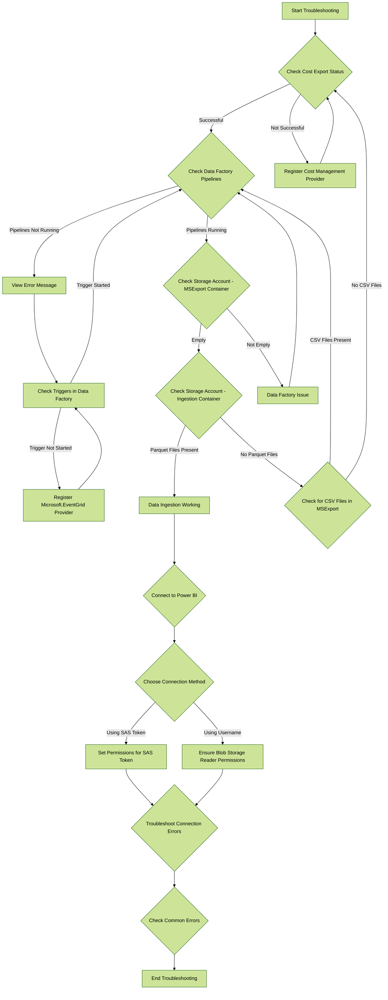

Troubleshooting common errors
Sorry to hear you're having a problem. We're here to help!
{: .fs-6 .fw-300 }

---

# FinOps Hubs Troubleshooting Guide

FinOps Hubs is composed of several services, and troubleshooting effectively requires identifying the problem area first. This guide is divided into two main sections: Data Ingestion and Connecting to Your Data. Always begin troubleshooting with the Data Ingestion piece to validate its services before moving on to Reports, as starting with the reports might not yield useful results.

## Section 1: Data Ingestion

The key services involved in Data Ingestion are:
1. Azure Data Factory
2. Storage Account
3. Cost Export

### Step 1: Validate Cost Export

The first component to check is the Cost Export. Follow these steps:

1. **Check Export Status**
   - Navigate to Cost Export in the Azure portal.
   - Ensure the export status is "Successful".
   
   **If the export status is not successful:**
   - Verify that the Cost Management register provider is registered for the subscription where Hubs is deployed.
   - To register the provider, go to the subscription in the Azure portal, select **Settings** > **Resource providers**, find the **Microsoft.CostManagement** row, and select the **Register** command at the top of the page.

### Step 2: Verify Data Factory Pipelines

Next, check if the Data Factory pipelines are functioning correctly.

1. **Monitor Pipelines**
   - Go to Data Factory Studio.
   - Select **Monitor** and ensure both pipelines are running.
   - Compare the last run time with the last update time; they should be close.

   **If pipelines are not running:**
   - Click on the error message to understand the issue.
   - In Data Factory Studio, go to **Manage** > **Author** > **Triggers** and verify the **msexports_FileAdded** trigger is started. If not, start it.
   
   **If the trigger fails to start with a “resource provider is not registered” error:**
   - Open the subscription in the Azure portal, then go to **Settings** > **Resource providers**.
   - Select the **Microsoft.EventGrid** row and click the **Register** command at the top of the page.
   - Wait for registration to complete, then start the **msexports_FileAdded** trigger again.

   **After the trigger starts:**
   - Re-run all connected Cost Management exports.
   - Data should be fully ingested within 10-20 minutes, depending on the size of the account.

### Step 3: Check Storage Account

The Storage Account involves two important containers: MSExport and Ingestion. 

1. **MSExport Container**
   - This container is where the Cost Export service sends the "raw" export files in .csv format.
   - When Hubs is working correctly, this container should be empty because Hubs transforms these raw files into .parquet format.
   - An empty MSExport container is a good sign.

2. **Ingestion Container**
   - This container is the destination for transformed data in .parquet format, which Power BI will connect to.
   - This container should always contain at least one .parquet file, but there can be multiple files.
   - **Verify Data in Ingestion Container**: 
     - Check the storage account to confirm data is in the ingestion container.
     - You should see either a **providers** or **subscriptions** folder.
     - Drill into the folders to confirm the presence of a **parquet** file.
     
     **If there are no parquet files:**
     - Check for any **.csv** files inside the **MSExport** container.
       
       **If a .csv file exists in the MSExport container:**
       - This indicates that the Data Factory pipeline is not transforming data to parquet. Refer back to the Data Factory section for troubleshooting.

       **If there are no .csv files in the MSExport container nor parquet files in the Ingestion container:**
       - This suggests an issue with Cost Export. Refer back to the Cost Export section for troubleshooting.

     **If a parquet file exists in the Ingestion container:**
     - The Data Ingestion component is working correctly. Proceed to the next section, "Connecting to Your Data".

---

## Section 2: Connecting to Your Data

Once you have confirmed you have the .parquet file inside of the Ingestion container, the next step is to connect Power BI to this storage account.

### Step 1: Choose Connection Method

First, decide how you are going to connect to this container: using a username or using a SAS key.

### Step 2: Connect Using a Username

1. **Ensure Blob Storage Reader Permissions**
   - Ensure you have the Blob Storage Reader permissions assigned.
   - This permission must be explicitly added to your user; it is not inherited even if you have "Owner" or "Contributor" permissions.
   - Ensure your user has this permission assigned to the Storage Account you want to connect to.

### Step 3: Connect Using a SAS Token (Recommended)

1. **Set Permissions for SAS Token**
   - Ensure you have set the following permissions to the token:
     - Allowed Services: Blob
     - Allowed Resource Types: Container and Object
     - Allowed Permissions: Read and List
     - Ensure you have also set a valid Start and Expiry date/time.

### Step 4: Troubleshoot Connection Errors

1. **Error: "Access to the resource is forbidden"**
   - This error likely indicates missing permissions. Refer back to this section of the guide and ensure you have the correct permissions.

2. **Special Case: Commitment Discounts Report**
   - If you have the correct permissions but still see the "Access to the resource is forbidden" error, review if the Billing Account you are connecting to is correct.
   - The Commitment Discounts Power BI template is provided with a sample billing ID, and if you don't change that to your own ID, you won't be able to connect.

---

## Error Messages

If you have validated all the previous steps and are still encountering issues, refer to the following error messages for further guidance:

- **Access to the resource is forbidden**: Ensure you have the appropriate permissions or correct SAS token settings.
- **Blob Storage Reader permissions not assigned**: Explicitly add Blob Storage Reader permissions to your user.
- **Cost Export not successful**: Register the Cost Management provider for the subscription.
- **Data Factory trigger not started**: Register the Microsoft.EventGrid provider and start the trigger.
- **No parquet files in Ingestion container**: Check the MSExport container for .csv files and ensure the Data Factory pipeline is transforming data correctly.
- **Connection to Billing Account**: Verify the Billing Account ID if using the Commitment Discounts report.

By following this guide and checking these common errors, you can systematically troubleshoot and resolve issues within the FinOps Hubs' data ingestion and connection processes.

