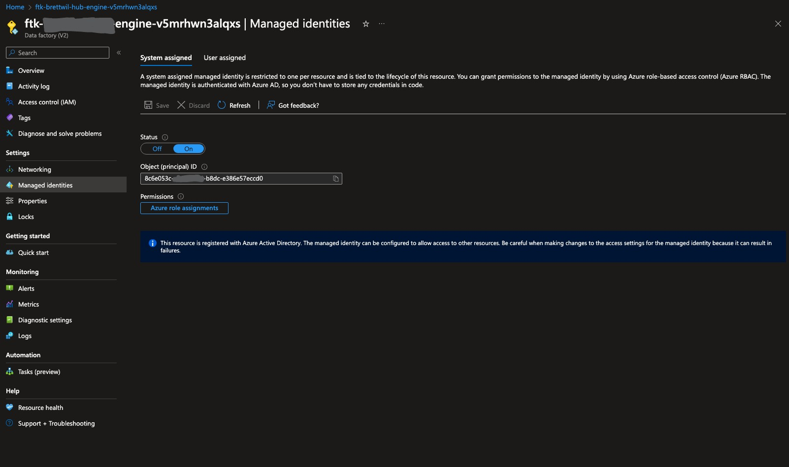

# 🛠️ Configure permissions

On this page:

- [Requirements](#requirements)
- [Configure permissions](#configure-permissions)

---

## Requirements

1. [Find your Azure Active Directory tenant id](https://learn.microsoft.com/en-us/azure/azure-portal/get-subscription-tenant-id#find-your-azure-ad-tenant).
2. [Find your Enrollment Id](https://learn.microsoft.com/en-us/azure/cost-management-billing/manage/view-all-accounts#switch-billing-scope-in-the-azure-portal).
3. Find the Identity for Azure Data Factory.
    1. Open the Azure Portal and browse to the resource group where you deployed the FinOps toolkit.
    2. Select the Azure Data Factory resource.
    3. Select the **Managed identities** tab.
    4. Make a note of the **Object (principal) ID** value. 

## Configure permissions

### Configure permissions with PowerShell

### Configure permissions in the Azure Portal
