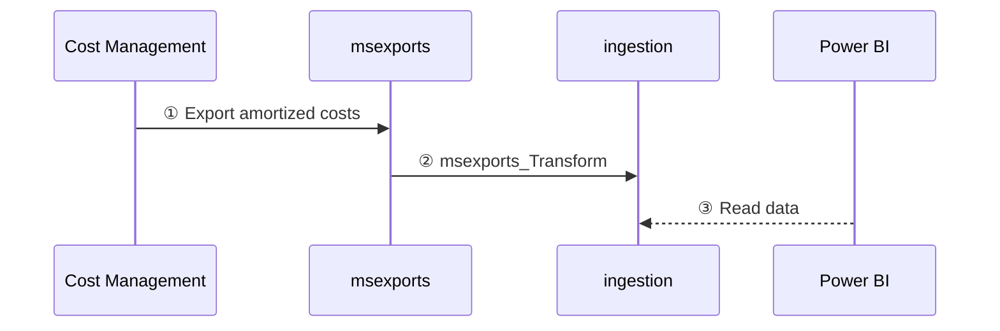

# Data processing

FinOps hubs perform a number of data processing activities to clean up, normalize, and optimize data. The following diagram shows how data flows from Cost Management into a hub instance:

 

1. Cost Management exports raw cost details to the **msexports** container.
2. The **msexports_transform** pipeline saves the raw data in parquet format to the **ingestion** container.
3. Power BI reads cost data from the **ingestion** container.

 
