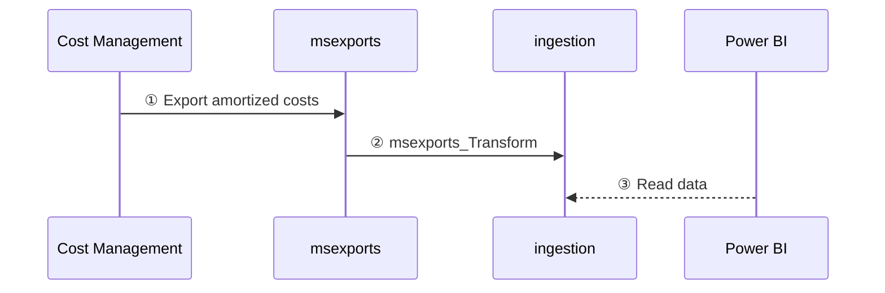

How data is processed in FinOps hubs
From data cleanup to normalization, FinOps hubs do the work so you can focus on driving business value.
{: .fs-6 .fw-300 }

---

FinOps hubs perform a number of data processing activities to clean up, normalize, and optimize data. The following diagram shows how data flows from Cost Management into a hub instance:

 

1. Cost Management exports raw cost details to the **msexports** container.
2. The **msexports_transform** pipeline saves the raw data in parquet format to the **ingestion** container.
3. Power BI reads cost data from the **ingestion** container.

---

## ⏭️ Next steps

[Get started](./README.md#-create-a-new-hub){: .btn .btn-primary .fs-5 .mb-4 .mb-md-0 .mr-2 }
[Learn more](./README.md️#-why-finops-hubs){: .btn .fs-5 .mb-4 .mb-md-0 }

 
