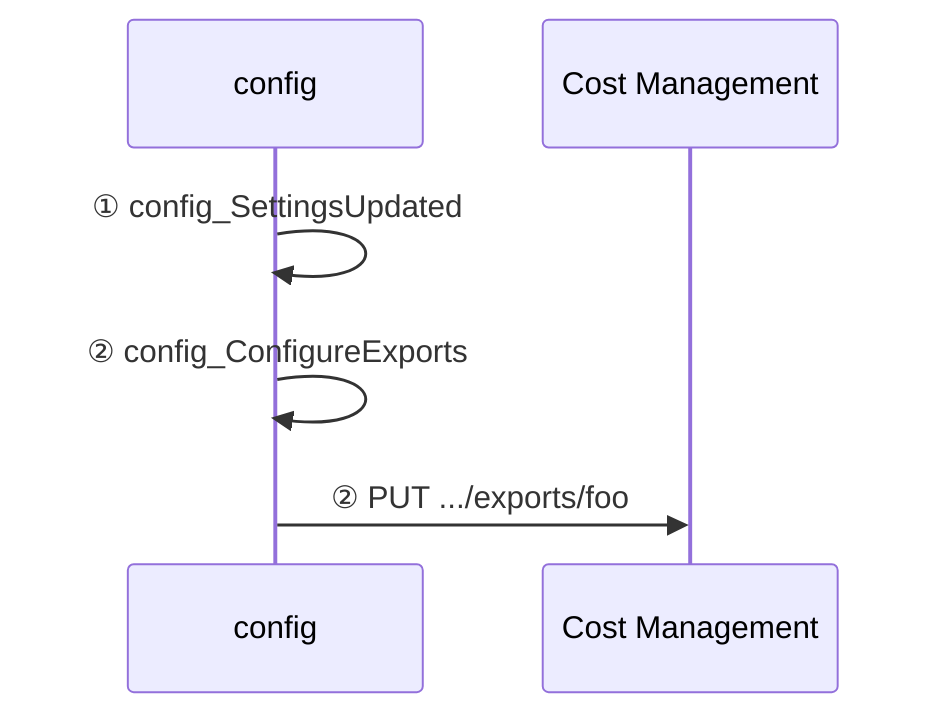
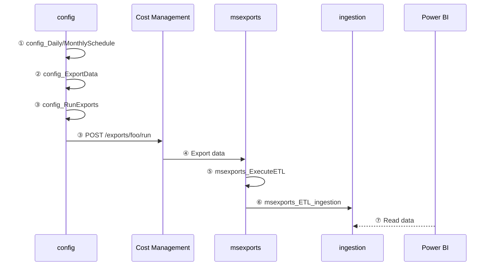
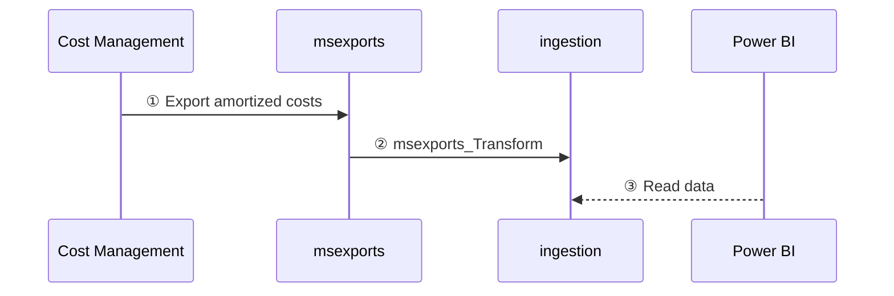

How data is processed in FinOps hubs
From data cleanup to normalization, FinOps hubs do the work so you can focus on driving business value.
{: .fs-6 .fw-300 }

---

FinOps hubs perform a number of data processing activities to clean up, normalize, and optimize data. The following diagrams show how data flows from Cost Management into a hub instance.

 

## Scope setup

This diagram shows what happens when a new, managed scope is added to a hub instance. Unmanaged scopes (where Cost Management exports are manually configured) do not require any setup.

 

1. The **config_SettingsUpdated** trigger runs when the **settings.json** file is updated.
2. The **config_ConfigureExports** pipeline creates new exports for any new scopes that were added.

 

## Data ingestion

This diagram shows what happens when the daily and monthly schedules are run.

 

1. The **config_DailySchedule** and **config_MonthlySchedule** triggers run on their respective schedules to kick off data ingestion.
2. The **config_ExportData** pipeline gets the applicable exports for the schedule that is running.
3. The **config_RunExports** pipeline executes each of the selected exports.
4. Cost Management exports raw cost details to the **msexports** container.
5. The **msexports_ExecuteETL** pipeline kicks off the extract-transform-load (ETL) process when files are added to storage.
6. The **msexports_ETL_ingestion** pipeline transforms the data to a standard schema and saves the raw data in parquet format to the **ingestion** container.
7. Power BI reads cost data from the **ingestion** container.

 

## FinOps hubs v0.0.1

 

1. Cost Management exports raw cost details to the **msexports** container.
2. The **msexports_transform** pipeline saves the raw data in parquet format to the **ingestion** container.
3. Power BI reads cost data from the **ingestion** container.

---

## ⏭️ Next steps

 

[Deploy](./README.md#-create-a-new-hub){: .btn .btn-primary .mt-2 .mb-4 .mb-md-0 .mr-4 }
[Learn more](./README.md#-why-finops-hubs){: .btn .mt-2 .mb-4 .mb-md-0 .mr-4 }

 
