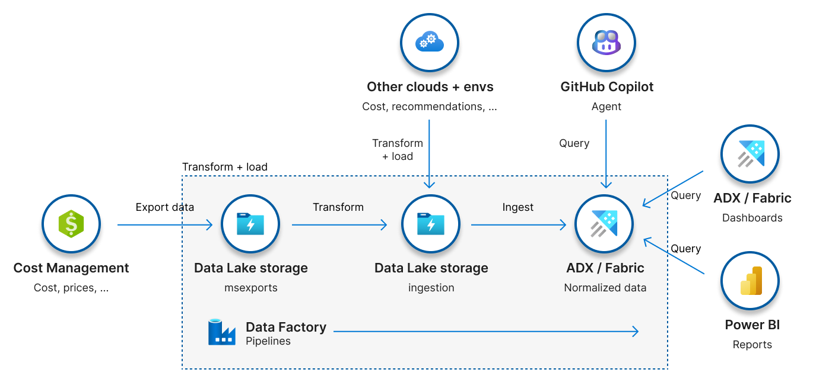

FinOps hubs
Open, extensible, and scalable cost governance for the enterprise.
{: .fs-6 .fw-300 }

<a class="btn btn-primary fs-5 mb-4 mb-md-0 mr-4" href="#deploy">Deploy</a>
<a class="btn fs-5 mb-4 mb-md-0 mr-4" target="_blank" href="https://learn.microsoft.com/cloud-computing/finops/toolkit/hubs/finops-hubs-overview">Documentation</a>

---

FinOps hubs are a reliable, trustworthy platform for cost analytics, insights, and optimization – virtual command centers for leaders throughout the organization to report on, monitor, and optimize cost based on their organizational needs.

    <h3>What's new in July 2025v0.12</h3>
    

        In July, FinOps hubs introduced a new v1_2 schema version with support for FOCUS 1.2 and performance improvements, added support to start Data Explorer if stopped, made managed exports optional, expanded supported VNet CIDR block sizes, and added support for Alibaba and Tencent cloud columns.
    

    
<a target="_blank" href="https://learn.microsoft.com/cloud-computing/finops/toolkit/changelog">See all changes</a>

## Understand and optimize cost and usage

    

        
📊 Standardized reporting

        
Flexible reports in Fabric, Power BI, and Data Explorer using the FinOps Open Cost and Usage Specification.

    

    

        
🤖 AI-powered experiences

        
Accelerate FinOps efforts with AI-powered tools that understand FinOps and seamlessly connect to your data.

    

    

        
☁️ Consolidate accounts

        
Centralize FinOps data across multiple subscriptions, accounts, and clouds.

    

    

        
🪛 Data preparation

        
FinOps hubs tunes data to fill gaps and improve overall data quality and completeness.

    

    

        
🏗️ Extensible platform

        
Bring your own data, build a custom allocation model, trigger custom alerts, and more.

    

    

        
🛡️ Secure processing

        
Secure financial and organizational data on a private, isolated network you control and govern.

    

    <h3>Estimated cost for FinOps hubs</h3>
    
FinOps hubs starts at $120/mo + $10/mo per $1 million in monitored spend.

    
Costs may be lower depending on your negotiated and commitment discounts.

## Unlocking scalable FinOps intelligence

FinOps hubs streamline cost governance with an open architecture that leverages Azure Data Factory to orchestrate seamless data ingestion into Microsoft Fabric or Azure Data Explorer. With rich reports, dashboards, and an AI agent that understands your data, FinOps hubs empower organizations with scalable analytics and actionable insights to facilitate data-driven financial decisions that maximize efficiency with confidence.

    

## Deploy FinOps hubs

Create a new or update an existing FinOps hub instance.

    

        <button class="ftk-accordion">1️⃣&nbsp; Register resource providers</button>
        

            

                Register the <b>Microsoft.CostManagementExports</b> and <b>Microsoft.EventGrid</b> resource providers for your subscription.
            

            

                <a class="btn mb-4 mb-md-0 mr-4" target="_blank" href="https://portal.azure.com/#view/Microsoft_Azure_Billing/SubscriptionsBladeV2">Go to subscriptions</a>
            

        

    

    

        <button class="ftk-accordion">2️⃣&nbsp; Plan your network architecture</button>
        

            

                Do you prefer public or private network routing?
            

            

                

                    
🌐 Public routing

                    

                        

                            Most common. Resources are reachable from the open internet. Access is controlled via RBAC.
                        

                        

                            Does not require additional configuration.  &nbsp;
                        

                        

                            <a class="btn mb-4 mb-md-0 mr-4" href="" style="visibility:hidden; width:100px">&nbsp;</a>
                        

                    

                

                

                    
🏢 Private routing

                    

                        

                            Most secure. Resources are only reachable from peered networks. Access is controlled via RBAC.
                        

                        

                            Work with your network admin to configure peering and routing so the FinOps hubs isolated network is reachable from your network.
                        

                        

                            <a class="btn mb-4 mb-md-0 mr-4" target="_blank" href="https://learn.microsoft.com/cloud-computing/finops/toolkit/hubs/private-networking">Plan for private networking</a>
                        

                    

                

            

        

    

    

        <button class="ftk-accordion">3️⃣&nbsp; Optional: Configure Microsoft Fabric</button>
        

            

                If connecting FinOps hubs to Microsoft Fabric, you will need to set up Real-Time Intelligence (RTI) before deploying the template and configure access after deploying the template.
            

            

                <a class="btn mb-4 mb-md-0 mr-4" target="_blank" href="https://learn.microsoft.com/cloud-computing/finops/toolkit/hubs/deploy#optional-set-up-microsoft-fabric">Configure RTI (before deployment)</a>
                <a class="btn mb-4 mb-md-0 mr-4" target="_blank" href="https://learn.microsoft.com/cloud-computing/finops/toolkit/hubs/deploy#optional-configure-fabric-access">Grant access (after deployment)</a>
            

        

    

    

        <button class="ftk-accordion">4️⃣&nbsp; Deploy the template</button>
        

            

                FinOps hubs works best with the <strong>Owner</strong> role. See template details for least-privilege roles.
            

            

                <a class="btn mb-4 mb-md-0 mr-4" target="_blank" href="https://aka.ms/finops/hubs/deploy">Deploy to Azure</a>
                <a class="btn mb-4 mb-md-0 mr-4" target="_blank" href="https://aka.ms/finops/hubs/deploy/gov">Deploy to Azure Gov</a>
                <a class="btn mb-4 mb-md-0 mr-4" target="_blank" href="https://aka.ms/finops/hubs/deploy/china">Deploy to Azure China</a>
                <a class="btn mb-4 mb-md-0 mr-4 ftk-externallink ftk-btnlink" target="_blank" href="https://learn.microsoft.com/cloud-computing/finops/toolkit/hubs/template">About the template</a>
            

        

    

    

        <button class="ftk-accordion">5️⃣&nbsp; Configure scopes to monitor</button>
        

            

                Configure exports manually or grant access to your hub to manage exports for you.
            

            

                <a class="btn mb-4 mb-md-0 mr-4" target="_blank" href="https://learn.microsoft.com/cloud-computing/finops/toolkit/hubs/configure-scopes">Configure scopes</a>
            

        

    

    

        <button class="ftk-accordion">6️⃣&nbsp; Set up reports and dashboards</button>
        

            

                <a class="btn mb-4 mb-md-0 mr-4" target="_blank" href="https://learn.microsoft.com/cloud-computing/finops/toolkit/hubs/configure-dashboards">Set up ADX dashboard</a>
                <a class="btn mb-4 mb-md-0 mr-4" target="_blank" href="https://learn.microsoft.com/cloud-computing/finops/toolkit/power-bi/setup#set-up-your-first-report">Set up Power BI</a>
            

        

    

    

        <button class="ftk-accordion">🙋‍♀️&nbsp; Help + support</button>
        

            

                If you run into any issues, retrace your steps to ensure all steps were followed correctly and completely. Most issues are caused by missed or incomplete steps. If you are receiving an error, check for mitigation steps; otherwise, use the troubleshooting guide to identify and resolve common issues.
            

            

                <a class="btn mb-4 mb-md-0 mr-4" target="_blank" href="https://learn.microsoft.com/cloud-computing/finops/toolkit/help/errors">Review errors</a>
                <a class="btn mb-4 mb-md-0 mr-4" target="_blank" href="https://learn.microsoft.com/cloud-computing/finops/toolkit/help/troubleshooting">Start troubleshooting</a>
                <a class="btn mb-4 mb-md-0 mr-4 ftk-btnlink" target="_blank" href="https://aka.ms/ftk/discuss">Ask a question</a>
            

        

    

 
<a class="btn mb-4 mb-md-0 mr-4" target="_blank" href="https://learn.microsoft.com/cloud-computing/finops/toolkit/hubs/deploy">Deployment tutorial</a>
<a class="btn mb-4 mb-md-0 mr-4" target="_blank" href="https://portal.azure.com/#view/HubsExtension/InProductFeedbackBlade/extensionName/FinOpsToolkit/cesQuestion/How%20easy%20or%20hard%20is%20it%20to%20use%20FinOps%20hubs%3F/cvaQuestion/How%20valuable%20are%20FinOps%20hubs%3F/surveyId/FTK/bladeName/Hubs/featureName/Marketing.Deploy">💜 Give feedback</a>

## Learn more from documentation

    

        
🗃️ <a target="_blank" href="https://learn.microsoft.com/cloud-computing/finops/toolkit/hubs/data-model">Data model</a>

        
Tables and functions available in FinOps hubs to support custom queries and reports.

    

    

        
📗 <a target="_blank" href="https://learn.microsoft.com/cloud-computing/finops/toolkit/help/data-dictionary">Data dictionary</a>

        
Explore the columns available in FinOps hubs with Data Explorer and Power BI reports.

    

    

        
⚙️ <a target="_blank" href="https://learn.microsoft.com/cloud-computing/finops/toolkit/hubs/data-processing">Data processing</a>

        
How data is processed in Data Factory pipelines and Data Explorer ingestion.

    

    

        
📦 <a target="_blank" href="https://learn.microsoft.com/cloud-computing/finops/toolkit/hubs/template">Deployment template</a>

        
Details about what's included in the FinOps hub deployment template. &nbsp;

    

    

        
🧮 <a target="_blank" href="https://learn.microsoft.com/cloud-computing/finops/toolkit/hubs/compatibility">Compatibility guide</a>

        
Identify breaking changes in each release that may require additional work when upgrading.

    

    

        
🛠️ <a target="_blank" href="https://learn.microsoft.com/cloud-computing/finops/toolkit/hubs/upgrade">Upgrade guide</a>

        
Things to keep in mind when upgrading an existing FinOps hub instance.

    

<a class="btn mb-4 mb-md-0 mr-4" target="_blank" href="https://learn.microsoft.com/cloud-computing/finops/toolkit/hubs/finops-hubs-overview">About FinOps hubs</a>
<a class="btn mb-4 mb-md-0 mr-4" target="_blank" href="https://portal.azure.com/#view/HubsExtension/InProductFeedbackBlade/extensionName/FinOpsToolkit/cesQuestion/How%20easy%20or%20hard%20is%20it%20to%20use%20FinOps%20hubs%3F/cvaQuestion/How%20valuable%20are%20FinOps%20hubs%3F/surveyId/FTK/bladeName/Hubs/featureName/Marketing.Docs">💜 Give feedback</a>

 
