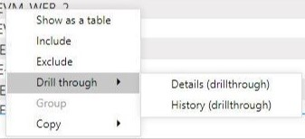

Reports
Visualize the Azure Optimization Engine rich recommendations and insights.
{: .fs-6 .fw-300 }

   
On this page

- [📒 Power BI recommendations report](#-power-bi-recommendations-report)
- [📒 Workbooks](#-workbooks)

## 📒 Power BI recommendations report

AOE includes a [Power BI report](http://aka.ms/AzureOptimizationEngine/powerbi) for visualizing recommendations. To use it, you have first to change the data source connection to the SQL Database you deployed with the AOE. In the Power BI top menu, choose Transform Data > Data source settings.

Then click on "Change source" and change to your SQL database server URL (don't forget to ensure your SQL Firewall rules allow for the connection).

The report was built for a scenario where you have an "environment" tag applied to your resources. If you want to change this or add new tags, open the Transform Data menu again, but now choose the Transform data sub-option. A new window will open. If you click next in "Advanced editor" option, you can edit the data transformation logic and update the tag processing instructions.

The report contains several pages described in the sections below.

### Overview - Latest recommendations

The initial page shows a summary of the latest recommendations available, filterable by multiple perspectives. If this page shows empty, you must refresh it to get last week's recommendations. If it still shows empty after refresh, then there might be some upstream issue with the AOE Automation runbooks.

### Cost - Cost recommendations overview

The **Cost** page displays the latest Cost recommendations generated by AOE (together with Azure Advisor ones). These recommendations are sorted by potential **monthly** savings. For each recommendation, there is a link to an Azure portal page with more details and a fit score that tells you how the recommendation fits your environment characteristics. For AOE custom recommendations, the fit score is also a measure of accuracy. The closer to a score of 5, the more fit/accurate the recommendation is.

### VM Right-Size overview and exploration

The **VM Right-Size Overview** page gives you a high-level understanding of Azure Advisor VM right-size recommendations' relative distribution. We can quickly see how many right-size recommended target SKUs are supported by the workload characteristics. If you have VMs sending the required performance counters to Log Analytics, you get a clearer view on the supportability of each recommendation. In the example below, we have some "unknowns", since one of the VMs was not sending performance metrics to the Log Analytics workspace.

The **VM Right-Size Exploration** page allows you to filter and do a deeper analysis of Azure Advisor VM right-size recommendations by multiple perspectives.

### Other Well-Architected pillars

Similar to the **Cost** page, there are other latest recommendations pages for each of the remaining Well-Archiected pillars: **High Availability** (Reliability), **Security**, **Performance** and **Operational Excellence**.

### Recommendation Details and History

When a recommendation is selected in one of the 5 Well-Architected pillars pages, you can right-click it and drill through the recommendation. There are two options available: **Recommendation Details** and **Recommendation History**.

The **Recommendation Details** option takes you to a page where you can see all the details of that specific recommendation. You can navigate back to the recommendations list by clicking on the upper left arrow (while holding the Ctrl key down). The **Recommendation History** page shows you for how long that recommendation has been raised over the past year and how its fit score has evolved.

## 📒 Workbooks

With AOE's Log Analytics Workbooks, you can explore many perspectives over the data that is collected every day. For example, costs growing anomalies, Microsoft Entra ID and Azure RM principals and roles assigned, how your resources are distributed, how your Block Blob Storage usage is distributed, how your Azure Benefits usage is distributed (supports only Enterprise Agreement customers) or exploring Azure Policy compliance results over time.

