Reports
Visualize the Azure Optimization Engine rich recommendations and insights.
{: .fs-6 .fw-300 }

   
On this page

- [📒 Power BI recommendations report](#-power-bi-recommendations-report)
- [📒 Workbooks](#-workbooks)

## 📒 Power BI recommendations report

AOE includes a [Power BI report](http://aka.ms/AzureOptimizationEngine/powerbi) for visualizing recommendations. To use it, you have first to change the data source connection to the SQL Database you deployed with the AOE. In the Power BI top menu, choose Transform Data > Data source settings.

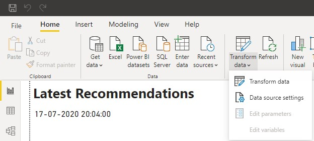

Then click on "Change source" and change to your SQL database server URL (don't forget to ensure your SQL Firewall rules allow for the connection).

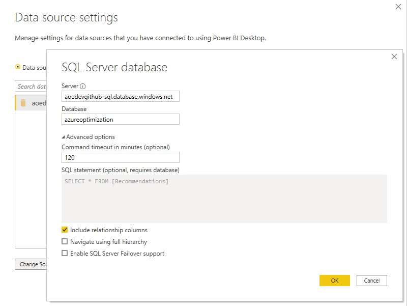

If the connection fails at the first try, this might be because the SQL Database was paused (it was deployed in the cheap Serverless plan). At the next try, the connection should open normally.

The report was built for a scenario where you have an "environment" tag applied to your resources. If you want to change this or add new tags, open the Transform Data menu again, but now choose the Transform data sub-option. A new window will open. If you click next in "Advanced editor" option, you can edit the data transformation logic and update the tag processing instructions.

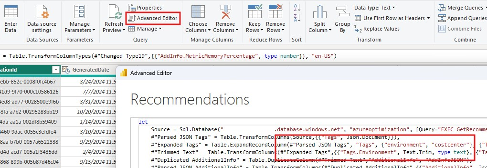

### Recommendations overview

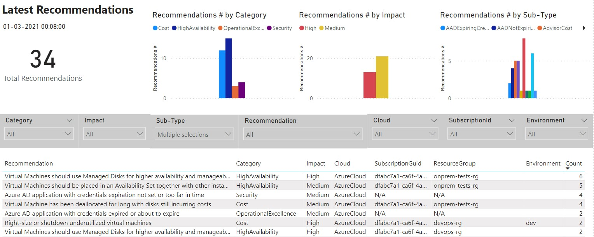

### Cost opportunities overview

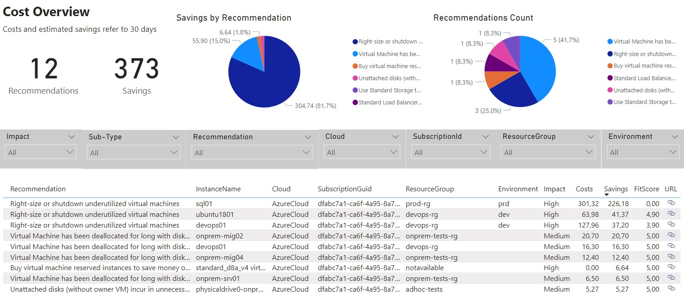

### Augmented VM right-size overview

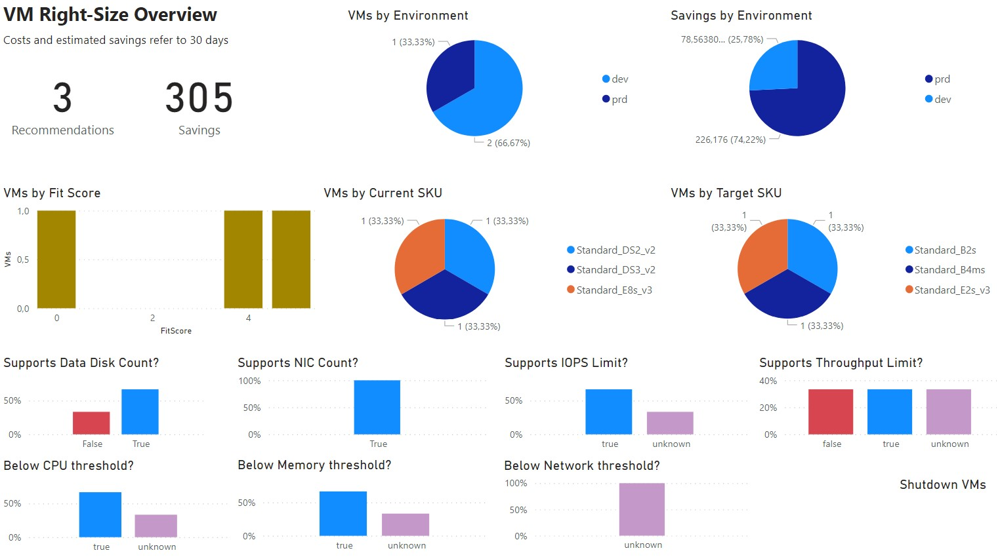

### Fit score history for a specific recommendation

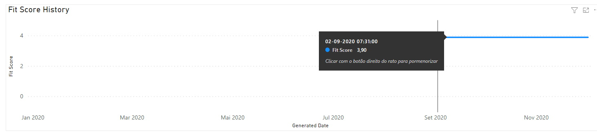

## 📒 Workbooks

With AOE's Log Analytics Workbooks, you can explore many perspectives over the data that is collected every day. For example, costs growing anomalies, Microsoft Entra ID and Azure RM principals and roles assigned, how your resources are distributed, how your Block Blob Storage usage is distributed, how your Azure Benefits usage is distributed (supports only Enterprise Agreement customers) or exploring Azure Policy compliance results over time.

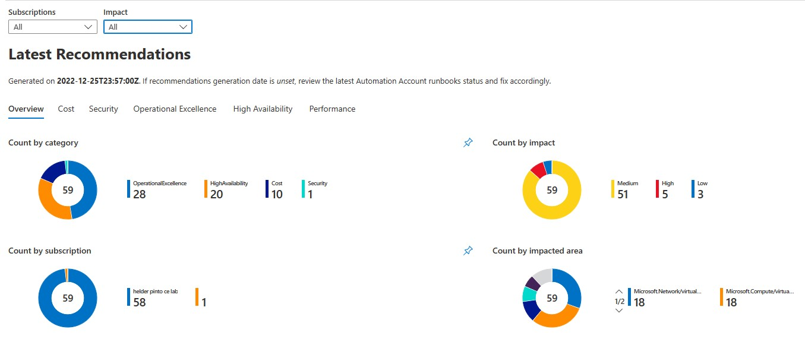

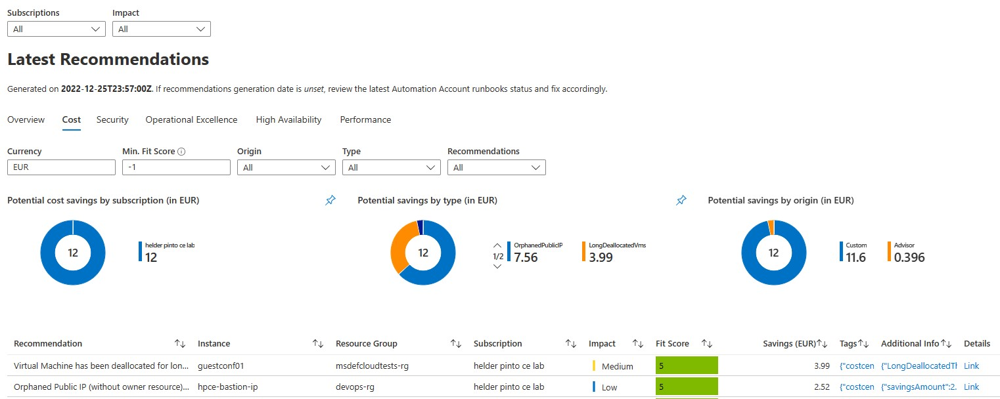

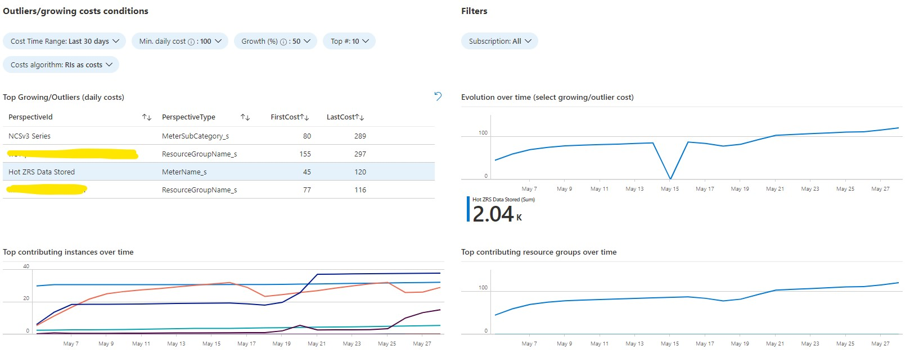

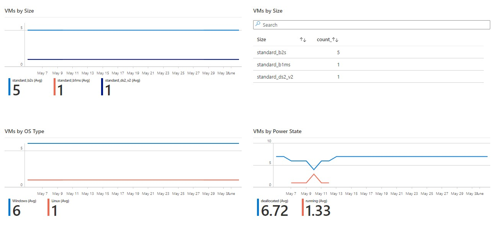

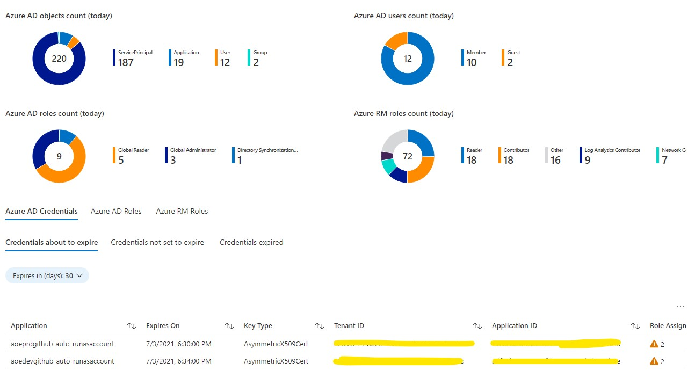

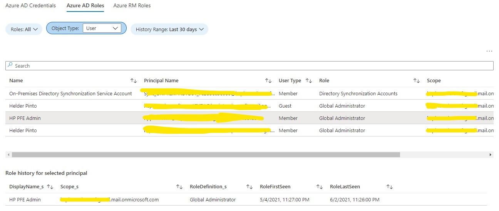

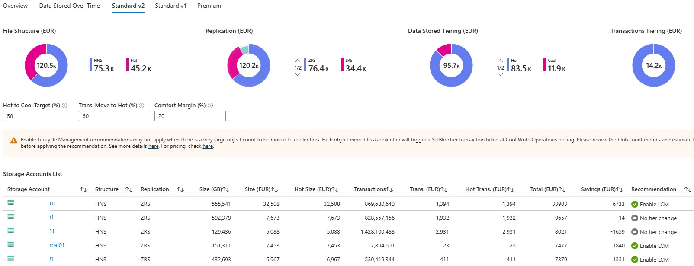

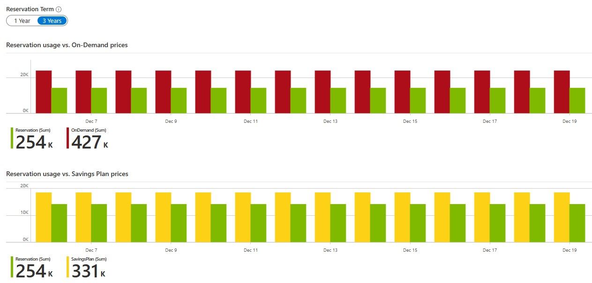

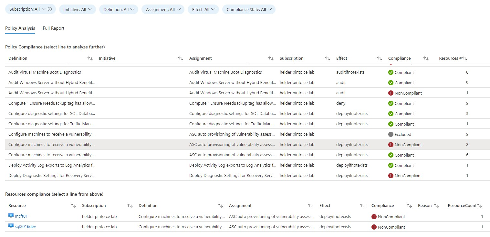
