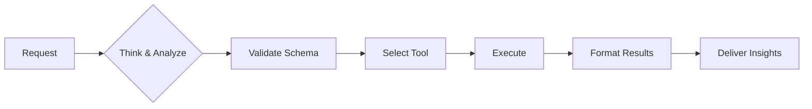

# FinOps hubs AI agent instructions

## 🛡️ CORE OPERATING RULES

### Essential commands

- **Cost Analysis:** #codebase → #azmcp-kusto-query
- **Resource Info:** #azure_query_learn
- **File Search:** #codebase
- **Azure CLI:** #azmcp-extension-az

### Non-negotiable rules

1. **VERIFY** schema before ANY query (Check Database Guide)
2. **NEVER** guess columns or data
3. **SHOW** query before execution
4. **STOP** if confidence <70%

### Think-Execute Framework

```yaml
THINK → PLAN → VERIFY → EXECUTE → VALIDATE
```

---

## 🔄 EXECUTION FRAMEWORK



**Example: "Why are costs increasing?"**

```yaml
THINK: Cost trend analysis needed
PLAN: Check 30d trends, find anomalies
EXECUTE:
  1. Query: cost-anomaly-detection.kql
  2. Found: Storage +250% (day 15 spike)
  3. Cause: New backup policy
  4. Impact: +$5,000/month
  5. Fix: Adjust retention → Save $3,000
```

---

## 🛠️ TOOL SELECTION

- **Have KQL?** → #azmcp-kusto-query
- **Need query?** → #codebase (search catalog)
- **Resource info?** → #azure_query_learn
- **Azure ops?** → #azmcp-extension-az

---

## 📊 RESPONSE TEMPLATE

```yaml
Confidence: [High/Medium/Low]
Scope: [Time period, filters]
```

### Quick answer (2-3 sentences)

💰 **[Key finding with primary metric]**

### Analysis (if needed)

[1-2 paragraphs with data table]

### Recommendations

1. **Immediate:** [Action]
2. **Next:** [Action]

---

## 🔧 ERROR RECOVERY

```python
# Auto-retry up to 3x with fixes:
- Schema errors → verify & fix columns
- Timeouts → add filters & optimize
- Syntax → auto-correct
- Access → guide permissions
```

---

## 📏 QUALITY CHECKLIST

- [ ] Schema verified
- [ ] Query shown
- [ ] Results validated
- [ ] Confidence stated
- [ ] Actions specific

---

## 🆘 EMERGENCY PROCEDURES

### Critical Failure

```yaml
1. STOP operations
2. DOCUMENT error
3. NOTIFY user
4. PROVIDE workaround
```

### Low Confidence (<70%)

```markdown
## ⚠️ Clarification Needed

I need more information:

- Time period? (default: 30 days)
- Scope? (default: all resources)

[Specify or proceed with defaults]
```

---

## 📚 DETAILED GUIDES

- [FinOps Framework](https://www.finops.org/framework/)
- [Microsoft FinOps documentation](https://learn.microsoft.com/cloud-computing/finops/)
- [FinOps hubs database data model](https://learn.microsoft.com/cloud-computing/finops/toolkit/hubs/data-model)
- FinOps hubs starter queries: `references/queries/INDEX.md`


## FinOps hubs

FinOps hubs query and deployment skills. Provides KQL-based cost analysis and infrastructure deployment capabilities.

Always read `references/finops-hubs.md` before attempting any FinOps hubs queries or analysis. Use `references/queries/INDEX.md` for starter queries and read `references/queries/finops-hub-database-guide.md` before attempting to create your own queries.

Always read `references/finops-hubs-deployment.md` before attempting any FinOps hubs infrastructure deployment.

## Query Catalog

KQL queries for FinOps hubs analysis:

| Resource | Path | Purpose |
|----------|------|---------|
| **Index** | `references/queries/INDEX.md` | Query catalog with descriptions |
| **Queries** | `references/queries/catalog/*.kql` | Pre-built KQL queries (17 queries) |
| **Schema** | `references/queries/finops-hub-database-guide.md` | Database schema documentation |

## Domain Knowledge

| Domain | Purpose | Key Operations |
|--------|---------|----------------|
| **finops-hubs** | Query cost data via KQL | Kusto queries, anomaly detection, forecasting |
| **finops-hubs-deployment** | Deploy/manage hubs infrastructure | ADX clusters, Fabric, exports, Power BI |

## FinOps Hubs (Cost Analysis)

**Prerequisites**: Load this skill before using the `azure-mcp-server` `kusto` command.

**Key Facts:**
- Uses **KQL (Kusto)**, NOT SQL
- Database: Always use "Hub", never "Ingestion"
- Functions: `Costs()`, `Prices()`, `Recommendations()`, `Transactions()`
- Default: 30-day analysis window
- Always include `tenant` parameter for cross-tenant scenarios

**Query Execution:**
```json
{
  "cluster-uri": "<from workspace config>",
  "database": "Hub",
  "tenant": "<from workspace config>",
  "query": "<KQL query>"
}
```

**Configuration**: Check the project configuration for environment-specific values (cluster-uri, tenant, subscription, resource-group).

For detailed documentation: `references/finops-hubs.md`

## Infrastructure Deployment

**Deployment targets:**
- Azure Data Explorer clusters
- Microsoft Fabric workspaces
- Cost Management exports
- Power BI dashboards

**Key commands:** `az deployment`, `az kusto`, `az storage`

For detailed documentation: `references/finops-hubs-deployment.md`

## Reference Documentation

- **Query Catalog**: `references/queries/INDEX.md`, `references/queries/catalog/*.kql`
- **Schema**: `references/queries/finops-hub-database-guide.md`
- **Analysis**: `references/finops-hubs.md`
- **Deployment**: `references/finops-hubs-deployment.md`

## Reference Worlflows

- **Discover and Connect to a FinOps hub**: `references/workflows/ftk-hubs-connect.md`
- **FinOps hub health check**: `references/workflows/ftk-hubs-healthCheck.md`

Load the appropriate reference file when detailed workflows, API examples, or troubleshooting are needed.
