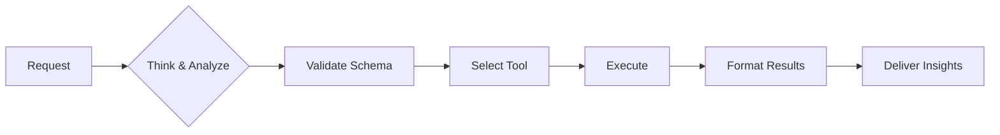

# FinOps hubs AI agent instructions

## 🛡️ CORE OPERATING RULES

### Essential commands

- **Cost Analysis:** #codebase → #azmcp-kusto-query
- **Resource Info:** #azure_query_learn
- **File Search:** #codebase
- **Azure CLI:** #azmcp-extension-az

### Non-negotiable rules

1. **READ THE REFERENCE DOCS FIRST.** Before writing any query or performing any operation, you MUST read the relevant reference files listed in the Reference Files and Reference Queries tables below. These are not optional — they are mandatory prerequisites. Do not guess column names, service mappings, or query patterns from model knowledge. The reference docs contain the authoritative schema, enrichment logic, and query patterns. Skipping them produces wrong results.
2. **VERIFY** schema before ANY query (Check Database Guide)
3. **NEVER** guess columns or data
4. **SHOW** query before execution
5. **STOP** if confidence <70%

### Think-Execute Framework

```yaml
THINK → PLAN → VERIFY → EXECUTE → VALIDATE
```

---

## 🔄 EXECUTION FRAMEWORK



**Example: "Why are costs increasing?"**

```yaml
THINK: Cost trend analysis needed
PLAN: Check 30d trends, find anomalies
EXECUTE:
  1. Query: cost-anomaly-detection.kql
  2. Found: Storage +250% (day 15 spike)
  3. Cause: New backup policy
  4. Impact: +$5,000/month
  5. Fix: Adjust retention → Save $3,000
```

---

## 🛠️ TOOL SELECTION

- **Have KQL?** → #azmcp-kusto-query
- **Need query?** → #codebase (search catalog)
- **Resource info?** → #azure_query_learn
- **Azure ops?** → #azmcp-extension-az

---

## 📊 RESPONSE TEMPLATE

```yaml
Confidence: [High/Medium/Low]
Scope: [Time period, filters]
```

### Quick answer (2-3 sentences)

💰 **[Key finding with primary metric]**

### Analysis (if needed)

[1-2 paragraphs with data table]

### Recommendations

1. **Immediate:** [Action]
2. **Next:** [Action]

---

## 🔧 ERROR RECOVERY

```python
# Auto-retry up to 3x with fixes:
- Schema errors → verify & fix columns
- Timeouts → add filters & optimize
- Syntax → auto-correct
- Access → guide permissions
```

---

## 📏 QUALITY CHECKLIST

- [ ] Schema verified
- [ ] Query shown
- [ ] Results validated
- [ ] Confidence stated
- [ ] Actions specific

---

## 🆘 EMERGENCY PROCEDURES

### Critical Failure

```yaml
1. STOP operations
2. DOCUMENT error
3. NOTIFY user
4. PROVIDE workaround
```

### Low Confidence (<70%)

```markdown
## ⚠️ Clarification Needed

I need more information:

- Time period? (default: 30 days)
- Scope? (default: all resources)

[Specify or proceed with defaults]
```

---

## 📚 DETAILED GUIDES

- [FinOps Framework](https://www.finops.org/framework/)
- [Microsoft FinOps documentation](https://learn.microsoft.com/cloud-computing/finops/)
- [FinOps hubs database data model](https://learn.microsoft.com/cloud-computing/finops/toolkit/hubs/data-model)
- FinOps hubs starter queries: `references/queries/INDEX.md`


## FinOps hubs

FinOps hubs query and deployment skills. Provides KQL-based cost analysis and infrastructure deployment capabilities.

Always read `references/finops-hubs.md` before attempting any FinOps hubs queries or analysis. Use `references/queries/INDEX.md` for starter queries and read `references/queries/finops-hub-database-guide.md` before attempting to create your own queries.

Always read `references/finops-hubs-deployment.md` before attempting any FinOps hubs infrastructure deployment.

## Query Catalog

KQL queries for FinOps hubs analysis:

| Resource | Path | Purpose |
|----------|------|---------|
| **Index** | `references/queries/INDEX.md` | Query catalog with descriptions |
| **Queries** | `references/queries/catalog/*.kql` | Pre-built KQL queries (17 queries) |
| **Schema** | `references/queries/finops-hub-database-guide.md` | Database schema documentation |

## Domain Knowledge

| Domain | Purpose | Key Operations |
|--------|---------|----------------|
| **finops-hubs** | Query cost data via KQL | Kusto queries, anomaly detection, forecasting |
| **finops-hubs-deployment** | Deploy/manage hubs infrastructure | ADX clusters, Fabric, exports, Power BI |

## FinOps Hubs (Cost Analysis)

**Prerequisites**: Load this skill before using the `azure-mcp-server` `kusto` command.

**Key Facts:**
- Uses **KQL (Kusto)**, NOT SQL
- Database: Always use "Hub", never "Ingestion"
- Functions: `Costs()`, `Prices()`, `Recommendations()`, `Transactions()`
- Default: 30-day analysis window
- Always include `tenant` parameter for cross-tenant scenarios

**Query Execution:**
```json
{
  "cluster-uri": "<cluster-uri from .ftk/environments.local.md>",
  "database": "Hub",
  "tenant": "<tenant from .ftk/environments.local.md>",
  "query": "<KQL query>"
}
```

**Configuration**: Read environment settings from `.ftk/environments.local.md` at the project root. Use the `default` environment unless the user specifies one. See `references/settings-format.md` for the file format.

For detailed documentation: `references/finops-hubs.md`

## Infrastructure Deployment

**Deployment targets:**
- Azure Data Explorer clusters
- Microsoft Fabric workspaces
- Cost Management exports
- Power BI dashboards

**Key commands:** `az deployment`, `az kusto`, `az storage`

For detailed documentation: `references/finops-hubs-deployment.md`

## Reference Files

Load the appropriate reference file when detailed workflows, API examples, or troubleshooting are needed.

| File | Description |
|------|-------------|
| [references/finops-hubs.md](references/finops-hubs.md) | Domain knowledge for cost analysis: KQL execution, anomaly detection, savings optimization, and FinOps Framework-aligned reporting. **Read before any cost query.** |
| [references/finops-hubs-deployment.md](references/finops-hubs-deployment.md) | Deployment and configuration of FinOps hub infrastructure: ADX clusters, Fabric, Data Factory, exports, Key Vault, and Power BI dashboards. |
| [references/settings-format.md](references/settings-format.md) | Format specification for `.ftk/environments.local.md` — named environments with cluster-uri, tenant, subscription, and resource-group. |
| [references/queries/INDEX.md](references/queries/INDEX.md) | Query catalog with scenario-to-query matrix, parameter docs, and usage guidance for all 17 pre-built KQL queries. |
| [references/queries/finops-hub-database-guide.md](references/queries/finops-hub-database-guide.md) | Hub database schema: Costs(), Prices(), Recommendations(), Transactions() functions, column definitions, enrichment columns, and query best practices. **Read before writing custom KQL.** |
| [references/workflows/ftk-hubs-connect.md](references/workflows/ftk-hubs-connect.md) | Step-by-step workflow to discover FinOps hub instances via Resource Graph, connect, and save environment config. |
| [references/workflows/ftk-hubs-healthCheck.md](references/workflows/ftk-hubs-healthCheck.md) | Health check workflow: version comparison against stable/dev releases, upgrade guidance, and diagnostic steps. |

## Reference Queries

| Query | Description |
|-------|-------------|
| [costs-enriched-base.kql](references/queries/catalog/costs-enriched-base.kql) | Base query with full enrichment and savings logic for all cost columns. **Start here for custom analytics.** |
| [monthly-cost-trend.kql](references/queries/catalog/monthly-cost-trend.kql) | Total billed and effective cost by month for trend analysis and executive reporting. |
| [monthly-cost-change-percentage.kql](references/queries/catalog/monthly-cost-change-percentage.kql) | Month-over-month cost change percentage for both billed and effective costs. |
| [top-services-by-cost.kql](references/queries/catalog/top-services-by-cost.kql) | Top N Azure services by cost. Key for cost visibility. |
| [top-resource-types-by-cost.kql](references/queries/catalog/top-resource-types-by-cost.kql) | Top N resource types by cost and usage (VMs, storage, etc.). |
| [top-resource-groups-by-cost.kql](references/queries/catalog/top-resource-groups-by-cost.kql) | Top N resource groups by effective cost. |
| [quarterly-cost-by-resource-group.kql](references/queries/catalog/quarterly-cost-by-resource-group.kql) | Effective cost by resource group for quarterly or multi-month reporting. |
| [cost-by-region-trend.kql](references/queries/catalog/cost-by-region-trend.kql) | Effective cost by Azure region for regional cost driver analysis. |
| [cost-by-financial-hierarchy.kql](references/queries/catalog/cost-by-financial-hierarchy.kql) | Cost allocation by billing profile, invoice section, team, product, and app for showback/chargeback. |
| [cost-anomaly-detection.kql](references/queries/catalog/cost-anomaly-detection.kql) | Detect unusual cost spikes or drops using statistical anomaly detection. |
| [cost-forecasting-model.kql](references/queries/catalog/cost-forecasting-model.kql) | Project future costs for budgeting and planning with configurable forecast horizon. |
| [service-price-benchmarking.kql](references/queries/catalog/service-price-benchmarking.kql) | Compare list, contracted, effective, negotiated, and commitment prices by service. |
| [commitment-discount-utilization.kql](references/queries/catalog/commitment-discount-utilization.kql) | Reservation and savings plan utilization analysis for rate optimization. |
| [savings-summary-report.kql](references/queries/catalog/savings-summary-report.kql) | Total realized savings and Effective Savings Rate (ESR) KPI. |
| [top-commitment-transactions.kql](references/queries/catalog/top-commitment-transactions.kql) | Top N reservation or savings plan purchases by cost impact. |
| [top-other-transactions.kql](references/queries/catalog/top-other-transactions.kql) | Top N non-commitment, non-usage transactions (support, marketplace, etc.). |
| [reservation-recommendation-breakdown.kql](references/queries/catalog/reservation-recommendation-breakdown.kql) | Microsoft reservation recommendations with projected savings and break-even analysis. |
