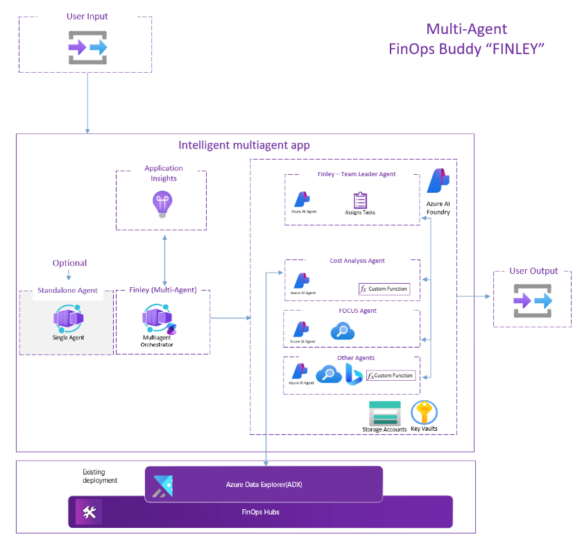
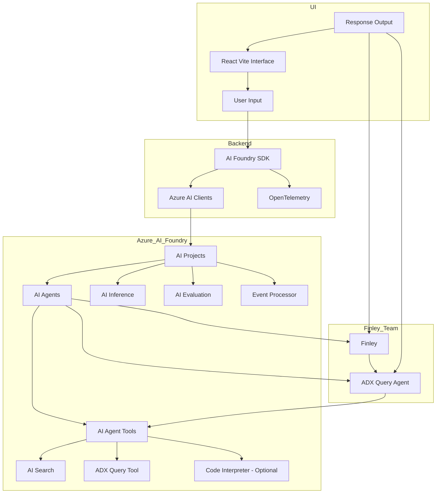
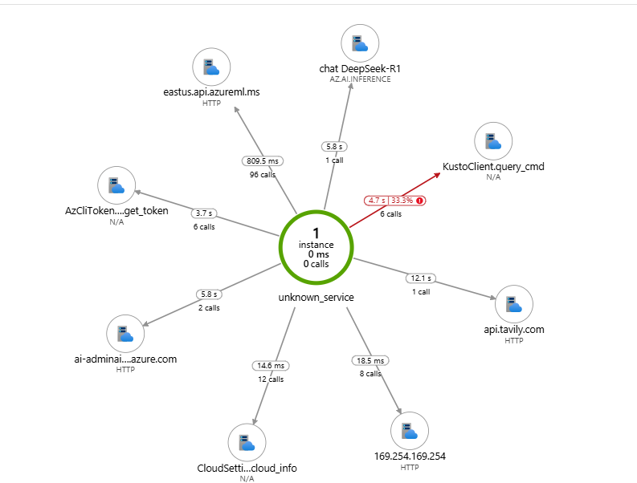
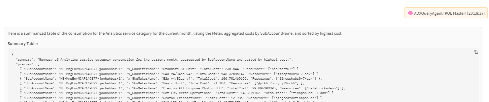

# 🤖 Finley: Multi-Agent FinOps Assistant for Azure

A sophisticated multi-agent system built on Azure AI Foundry, enabling collaborative AI agents to work together on complex tasks.

**Finley** is an intelligent, multi-agent assistant designed to help organizations explore, analyze, and optimize their Azure cloud environment. Powered by [Azure AI Agents](https://learn.microsoft.com/en-us/azure/ai-services/agents/), Finley coordinates a team of specialized agents to handle cost and resource-related questions using real Azure data.

---
## Overview

This project implements a team-based AI agent system that leverages Azure AI Foundry's capabilities to create, manage, and coordinate multiple AI agents. The system allows for dynamic task delegation, inter-agent communication, and collaborative problem-solving.

## Features

- **Team-based Architecture**: Create and manage teams of AI agents with specialized roles
- **Dynamic Task Delegation**: Agents can delegate tasks to other team members
- **Configurable Agent Roles**: Define custom roles and capabilities for each agent
- **Azure Integration**: Built on Azure AI Foundry for enterprise-grade AI capabilities
- **OpenTelemetry Support**: Built-in tracing and monitoring capabilities
- **YAML-based Configuration**: Easy configuration of agent teams and their capabilities

## Project Structure

```
backend/
└── agent_instructions/ # Agent instructions and guidelines
├── utils/             # Utility functions and helpers
├── user_functions/     # Custom user-defined functions
├── agent_team.py      # Core agent team implementation
├── agent_trace_configurator # Core Telemetry implementation
├── agent_team_config.yaml  # Team configuration
├── finley_team_orchestration.py   # Finley-specific team 
├── finley_team_singleton.py   # Finley-specific team to launch instance and interact with API
├── main.py   # API entry point for interaction with Front-end 
├── requirements.txt   # Project dependencies
├── README.md
├── frontend/      # Frontend (React/Vite UI Interface)

.env # For local dev and to be able to run the solution
.env.example
```

## Architecture



## Architecture - Workflow

## 🧠 Agents

| Agent Name         | Role & Capabilities                                                                 |
|--------------------|--------------------------------------------------------------------------------------|
| **Finley**         | Your FinOps Expert. Calls the right tools based on user intent and summarizes results. |

---

## 🔄 How It Works

1. 🧑 User submits a question (e.g. "What are the top 5 cost consumers over 6 months?")
2. 🧠 **Finley** interprets the intent and chooses the right tool for the job.
3. ⚙️ That agent runs a real-time query using:
   - Azure Data Explorer (ADX) Query Tool
   - AI/Web Search Tool
4. 📄 The agent returns results as structured JSON.
5. 📊 The system generates:
   - A readable Markdown table
   - A formatted summary

---

## 📂 Output Examples

```bash
💬 Input:
What are my top 5 consumers by resource for the last 6 months?
```
## Markdown preview:

Top 5 cost consumers by resource for the last 6 months have been identified.

| ResourceName | TotalCost |
| --- | --- |
| finopshubs0-7-adx | 1829.76 |
| hacktest07 | 1502.85 |
| ssawafjml001 | 1347.94 |
| stgazfilesprovisionedv1 | 967.99 |
| azfw-vnet-hub-secured | 658.79 |

## UI Output Examples

## 🛠 Tech Stack
- Python 3.11+
- Azure AI Agent SDK
- Azure Identity
- Azure Data Explorer (ADX)
- AI Search/Web Search (Bing, 3rd parties)
- React Vite UI

## Prerequisites

- Python 3.10 or higher
- Azure subscription with AI Foundry access
- Azure AI Foundry Project, Hub and dependent resources: Models, AI Search,....
- An instance of FinOps Hub   
- Required Azure credentials and permissions

## Installation - Backend

1. Clone the repository
2. Create a virtual environment:
   ```bash
   python -m venv .venv
   source .venv/bin/activate  # On Windows: venvmultiagentaifoundry\Scripts\activate
   ```
3. Install dependencies:
   ```bash
   pip install -r requirements.txt
   ```

## Configuration
Create a file named `.env` in the project root with:
   ```
   PROJECT_CONNECTION_STRING=your_connection_string_here
   AZURE_AI_AGENT_MODEL_DEPLOYMENT_NAME=your_deployment_name_here
   ```
**Check the example file for all variables needed.**

## Frontend Usage


## Example when unrelated questions asked:

### Quick Start Guide

1. **Create .env file**
   Create a file named `.env` in the project root with:
   ```
   PROJECT_CONNECTION_STRING=your_connection_string_here
   AZURE_AI_AGENT_MODEL_DEPLOYMENT_NAME=your_deployment_name_here
   Check the example file for all variables needed.
   ```

2. **Install Dependencies**
    Make sure you running inside the virtual environment!
    Create it using python -m venv venv or any other name
    Activate it! See Installation steps above
   ```bash
   pip install -r requirements.txt
3. **Run the Backend**
   ```bash
   uvicorn finley_singleagent:app --host 127.0.0.1 --port 8000
5. **Log into azure using az login**

6. **Run the Solution**
    First install all necessary packages by running npm install inside the frontend folder
    ```bash
    npm install 
   ```
   **Web Interface:**
   ```bash
   npm run dev
   ```
   This will launch a user-friendly web interface where you can chat with the agent.

## Testing


## Logging and Troubleshooting:
Tracing is enabled. We use Application Insights for logging and troubleshooting.



### Quick Start Guide for Testing

1. **Setup**
   ```bash
   # Create a directory for your test results
   mkdir prompt_test_results
   cd prompt_test_results
   ```

2. **Running Tests**
   - Open a Python terminal or notebook
   - Import and initialize the team as shown in the Usage section
   - Start asking questions using the web interface
   - Save responses in your `prompt_test_results` folder

3. **Documentation**
   - Keep a simple text file or spreadsheet to track:
     - Questions asked
     - Responses received
     - Any issues or observations

4. **Tips**
   - Start with simple questions to verify basic functionality
   - Test different types of queries (analytical, creative, technical)
   - Note any unexpected responses or behaviors
   - Keep track of response times and quality

## Contributing

1. Fork the repository
2. Create a feature branch
3. Commit your changes
4. Push to the branch
5. Create a Pull Request

## License

This project is licensed under the MIT License - see the LICENSE file for details.

## Acknowledgments

- Azure AI Foundry team
- OpenTelemetry community
- Contributors and maintainers

