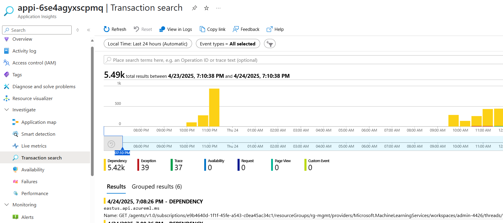

# 🤖 Finley: Multi-Agent FinOps Assistant for Azure

**Finley** is an intelligent, multi-agent assistant designed to help organizations explore, analyze, and optimize their Azure cloud environment. Powered by [Azure AI Agents](https://learn.microsoft.com/en-us/azure/ai-services/agents/) and [Semantic Kernel](https://github.com/microsoft/semantic-kernel), Finley coordinates a team of specialized agents to handle cost and resource-related questions using real Azure data.

---


## Architecture


## 🧠 Agents

| Agent Name         | Role & Capabilities                                                                 |
|--------------------|--------------------------------------------------------------------------------------|
| **Finley**         | Team lead and planner. Delegates tasks based on user intent and summarizes results. |
| **ADXQueryAgent**  | Specialist in Azure Data Explorer (KQL) queries for cost & usage analytics.         |
| **ARGQueryAgent**  | Specialist in Azure Resource Graph queries for resource inventory and metadata.     |

---

## 🔄 How It Works

1. 🧑 User submits a question (e.g. "What are the top 5 cost consumers over 6 months?")
2. 🧠 **Finley** interprets the intent and delegates the task to the appropriate expert agent.
3. ⚙️ That agent runs a real-time query using:
   - Azure Data Explorer (ADX)
   - Azure Resource Graph (ARG)
4. 📄 The agent returns results as structured JSON.
5. 📊 The system generates:
   - A readable Markdown table
   - A downloadable CSV file

---

## 📂 Output Examples

```bash
💬 Input:
Show all VMs that haven't been used in 30 days.

✅ Output files saved:
 - Markdown: outputs/ARGQueryAgent-output.md
 - CSV:      outputs/ARGQueryAgent-output.csv
```
## Markdown preview:

List of Virtual Machines that have not been used in the last 30 days.

| PowerState | location | name | resourceGroup |
| --- | --- | --- | --- |
| VM deallocated | uksouth | myVM0 | aoetestresources |
| VM deallocated | northeurope | tubdemosec-vm-01 | rg-tubsecdemo |


Top 5 cost consumers by resource for the last 6 months have been identified.

| ResourceName | TotalCost |
| --- | --- |
| finopshubs0-7-adx | 1829.76 |
| hacktest07 | 1502.85 |
| ssawafjml001 | 1347.94 |
| stgazfilesprovisionedv1 | 967.99 |
| azfw-vnet-hub-secured | 658.79 |

## UI Output Examples





## 🛠 Tech Stack
- Python 3.11+
- Azure AI Agent SDK
- Semantic Kernel
- Azure Identity
- Azure Data Explorer (ADX)
- Azure Resource Graph
- Gradio UI

## How to test
1. Create python virtual environment
2. Install packages from the requirements file
3. start the Gradio UI server by navigation to the multiagent_finley folder, backend and running 'python .\ui_app.py'