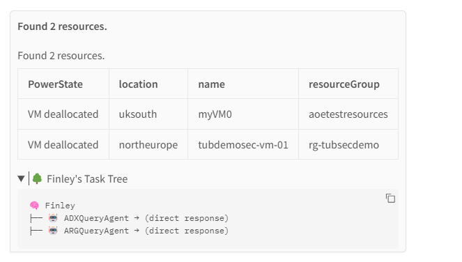

Find net new resources this month vs last month and provide the full list.
Query my Azure environment and show the list of Virtual Machines that haven't been used in the last 30 days using Resource Graph
Find unattached disks in my environment. Use the ARGQuery Agent to run queries against Azure Resource Graph.
Get me a list of all storage accounts.
### Summary
Found 3 Virtual Machines that haven't been used in the last 30 days. Here is the list:

| id | name | type | location | lastBootTime |
|----|------|------|----------|--------------|
| /subscriptions/e9b4640d-1f1f-45fe-a543-c0ea45ac34c1/resourceGroups/aoetestresources/providers/Microsoft.Compute/virtualMachines/myVM0 | myVM0 | microsoft.compute/virtualmachines | uksouth | null |
| /subscriptions/e9b4640d-1f1f-45fe-a543-c0ea45ac34c1/resourceGroups/aoetestresources/providers/Microsoft.Compute/virtualMachines/myVM1 | myVM1 | microsoft.compute/virtualmachines | uksouth | null |
| /subscriptions/e9b4640d-1f1f-45fe-a543-c0ea45ac34c1/resourceGroups/rg-tubsecdemo/providers/Microsoft.Compute/virtualMachines/tubdemosec-vm-01 | tubdemosec-vm-01 | microsoft.compute/virtualmachines | northeurope | null |

Find unused disks in ARG

Find unattached disks in my environment. Use the ARGQueryAgent to run queries against Azure Resource Graph.

Find deallocated VMs in my environment. Use the ARGQuery Agent to run queries against Azure Resource Graph.

Find Premium Disks in my environment. Use the ARGQuery Agent to run queries against Azure Resource Graph.